Project 2T
================
Cassio Monti Smitali Patnaik
10-08-2022

# Required Packages

Some packages necessary to run the code

``` r
# Getting relevant packages and calling the api
library(jsonlite)
library(tidyverse)
```

# Key Usage

Defining the keys used due to limited access.

``` r
key_id = c("foHUdTopBg22FTwv4b11YQsLuZXQkALG",
           "asWU9di2FThCr1ywIpgyNdqwXMf0fpj4")
```

# Functions for Calling the API via EndPoints

There are two functions so far, the first pull down the aggregate
information about the tickers with some metrics. The second function
pull down the ticker names and some characteristics as location, ticker
type, and more.

## Aggregate EndPoint

For time data and time EDA

``` r
# create the URL for aggregate endpoint:
# This function has some default values.
agg_endpoint = function(stocksTicker="AAPL", from = "2021-07-22", to = "2022-07-22",mltplr=30, timespan="day", ky, ...){

  # passing the components of the URL for the API:
  # base + endpoint 1
  base_endpoint = "https://api.polygon.io/v2/aggs/"
  
  # last part of the URL defining some defaults
  last_code = "?adjusted=true&sort=asc&limit=5000"
  
  # key for accessing API
  key = paste0("&apiKey=", key_id[ky])
  
  # converting the multiplier to character
  mltplr = as.character(mltplr)
  
  # creating the URL call
  call = paste0(base_endpoint,"ticker/",stocksTicker,"/range/",mltplr,"/",
                timespan,"/",from,"/",to,last_code,key)
  
  # assigning the call to an object
  p = fromJSON(call)

  # getting results from the object
  tb = p$results
  tckr = p$ticker
  
  # working with the dates
  d1 = as.Date(from) # transforms initial date from char to date format
  d2 = as.Date(to) # transforms last date from char to date format
  d = seq(d1,d2, by ="month") # sequence by month
  
  # combining the final object with ticker name, date, and metrics
  out = tibble(tckr,d,tb)
  
  # returning the final tibble object
  return(out)
  
}
```

## Grouped Daily EndPoints

For merging with the ticker endpoint data set and go to the EDA.

``` r
grouped_endpoint = function(date= "2022-07-14", adjusted = "true", otc = "true", ky, ...){
  
  adjusted = tolower(adjusted)
  
  # base + endpoint 1
  base="https://api.polygon.io/v2/aggs/grouped/locale/us/market/stocks/"
  
  # key for accessing API
  key = paste0("&apiKey=", key_id[ky])
  
  # creating the URL call
  call = paste0(base,date,"?adjusted=",adjusted,"&include_otc=",otc,key)
  
  # assigning the call to an object
  p = fromJSON(call)

  out = tibble(p$results)
  
  return(out)
}
```

## Ticker EndPoint

This function aims to call tickers from common stock mainly and other
markets as well as crypto currencies for further analysis of both.

``` r
# tickers endpoint= get ticker names
# create the URL for the ticker endpoint - two calls: i) ticker names; and
# ii) otc names
ticker_endpoint = function(type = NULL, market = "stocks", limit = 1000, ticker = NULL, ky, ...){
  

  if(limit > 1000){
    limit = 1000
    message("Warning: the max limit is 1000 for free access!")
  }

  last_code = "&active=true&sort=locale&order=asc&limit="
  
  key = paste0("&apiKey=", key_id[ky])

    
  if(!is.null(ticker)){
    
      base_endpoint = "https://api.polygon.io/v3/reference/tickers?ticker="
      
      call = paste0(base_endpoint,ticker)

  }else{
    
      base_endpoint = "https://api.polygon.io/v3/reference/tickers?market="
      
      market = tolower(market)
      
      call = paste0(base_endpoint,market)

  }
  
  if(!is.null(type)){
    
    type = tolower(type)
    
    tp = switch(type,
               "common stock" = "CS",
               "investment fund" = "FUND",
               "exchanged-traded fund" = "ETF",
               "standard & poors" = "SP",
                stop("This is not one of the allowed options!"))
    
    call = paste0(call, "&type=", tp, last_code, limit, key)
    
  }else{
    
    call = paste0(call, last_code, limit, key)
    
  }

  p = fromJSON(call)
  
  return(p$results)

}
```

## Wrapper Function

This function takes information from the previous two functions and
combine them when it is possible.

``` r
# ticker vector to call the API
tickers = c("AAPL","GOOGL", "MSFT","WY","RYN")

# calling the full name of the companies
CompanyName = sapply(tickers, function(x){
  return(ticker_endpoint(ticker = x, ky = 1)$name)
})

# call multiple tickers from agg_endpoint and return sa df
agg_data = lapply(tickers, agg_endpoint, ky = 1)

Combining_calls = function(tickerID, ...){
  
  # grouping quantitative EDA data - time analysis
  time_df = lapply(1:length(agg_data), function(x){
    
    return(cbind(Company_Name = CompanyName[x], agg_data[[x]]))
  })
  
  time_df <- do.call("rbind", time_df)
  
  time_df = as_tibble(time_df)
  
  
  # grouping categorical EDA data
  tout = ticker_endpoint(market = "stocks", limit = 1000, ky=2)

  tout2 = ticker_endpoint(market = "otc", limit = 1000, ky=2)
  
  gout = grouped_endpoint(otc = "true",ky=2)

  df1 = inner_join(tout2, gout, by = c("ticker" = "T"))

  df11= df1 %>%
  select(ticker, name, market, type, composite_figi,share_class_figi, v:n)

  df2 = inner_join(tout, gout, by = c("ticker" = "T"))

  df22 = df2 %>%
    select(ticker, name, market, type,composite_figi,share_class_figi, v:n)

  df = rbind(df11, df22)

  df = df %>% drop_na()

  return(list(df = df, time_df = time_df))
  
}


out = Combining_calls(tickerID = tickers)

df = out$df

time_df = out$time_df
```

# EDA

## For several tickers

### Plots for raw data

``` r
# for categorical and numerical EDA
df
```

    ## # A tibble: 871 × 14
    ##    ticker name   market type  compo…¹ share…²      v      vw       o       c       h
    ##    <chr>  <chr>  <chr>  <chr> <chr>   <chr>    <dbl>   <dbl>   <dbl>   <dbl>   <dbl>
    ##  1 FBMCF  BUFFA… otc    OS    BBG000… BBG001… 1.86e3 9.5 e-3 9.5 e-3 9.5 e-3 9.5 e-3
    ##  2 CNTMF  CANSO… otc    OS    BBG00N… BBG00N… 7.88e4 1.95e-1 2   e-1 1.9 e-1 2.05e-1
    ##  3 BCMRF  BCM R… otc    OS    BBG000… BBG001… 8.02e4 1.28e-1 1.22e-1 1.28e-1 1.3 e-1
    ##  4 CRMK   CERME… otc    CS    BBG000… BBG001… 2   e3 2   e-2 2   e-2 2   e-2 2   e-2
    ##  5 HEOFF  H2O I… otc    OS    BBG000… BBG001… 4.12e3 1.51e+0 1.45e+0 1.54e+0 1.54e+0
    ##  6 BDWBY  BUDWE… otc    ADRC  BBG00Q… BBG00Q… 7.36e3 1.13e+1 1.14e+1 1.12e+1 1.14e+1
    ##  7 HKMPY  HIKMA… otc    ADRC  BBG000… BBG001… 1.58e3 3.99e+1 3.94e+1 3.97e+1 4.05e+1
    ##  8 MKRYF  MANIT… otc    OS    BBG001… BBG001… 5.1 e2 1   e-5 1   e-5 1   e-5 1   e-5
    ##  9 ECAOF  ECO A… otc    OS    BBG000… BBG001… 2.7 e3 3.65e-1 3.61e-1 3.75e-1 3.75e-1
    ## 10 NHMD   NATE'… otc    CS    BBG000… BBG001… 1.89e7 1.46e-3 1.6 e-3 1.4 e-3 1.7 e-3
    ## # … with 861 more rows, 3 more variables: l <dbl>, t <dbl>, n <int>, and
    ## #   abbreviated variable names ¹​composite_figi, ²​share_class_figi

``` r
table(df$market)
```

    ## 
    ##    otc stocks 
    ##    193    678

``` r
table(df$type)
```

    ## 
    ## ADRC   CS  ETF  ETN  ETV FUND   OS UNIT 
    ##   71  470  202    4    5   37   71   11

``` r
table(df$market, df$type)
```

    ##         
    ##          ADRC  CS ETF ETN ETV FUND  OS UNIT
    ##   otc      44  75   0   0   0    1  71    2
    ##   stocks   27 395 202   4   5   36   0    9

``` r
# type vs market
g = ggplot(df, aes(x = market))
g + geom_bar(aes(fill = type), position = "dodge")
```

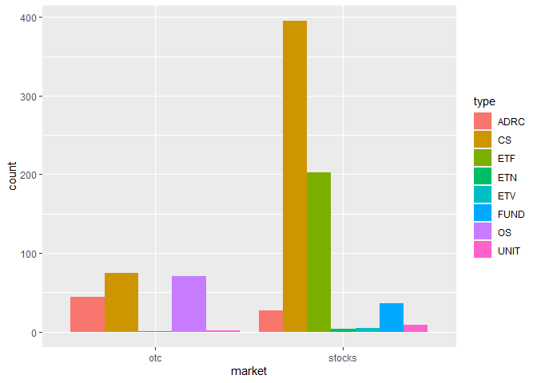<!-- -->

### Plots for modified Data - part 1

``` r
# quantitative vs market & type
# group by type and market and average
df_price = df %>% 
  group_by(market, type) %>%
  summarise(avg_price = mean(c), price_range = (h - l))

h = ggplot(df_price, aes(x = avg_price))

# histograms by market type
h + geom_density(adjust = 0.5, alpha = 0.5, aes(fill = market))
```

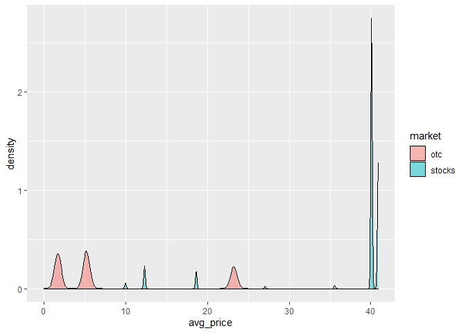<!-- -->

``` r
h + geom_density(adjust = 0.5, alpha = 0.5, aes(fill = type))
```

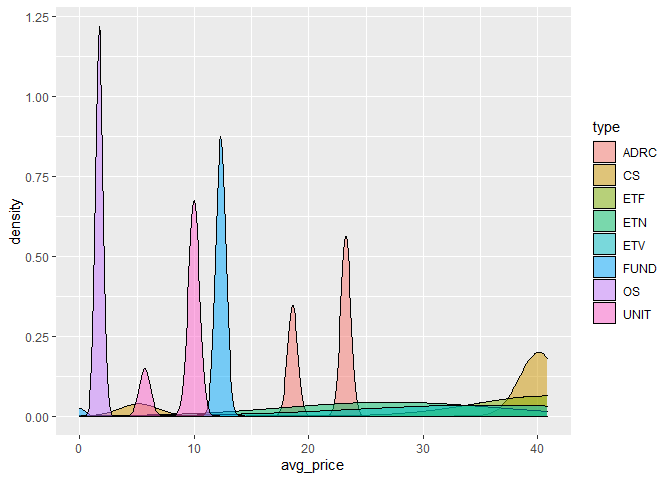<!-- -->

``` r
# histogram + density plot for closed price by market type
h + geom_histogram(aes(fill = market, y = ..density..), position = "dodge") + 
  geom_density(adjust = 0.5, alpha = 0.5, aes(fill = market))
```

<!-- -->

``` r
h + geom_histogram(aes(fill = type, y = ..density..), position = "dodge") + 
  geom_density(adjust = 0.5, alpha = 0.5, aes(fill = type))
```

<!-- -->

``` r
# boxplot by market and typer for avg price
h + geom_boxplot(aes(y = market)) + coord_flip()
```

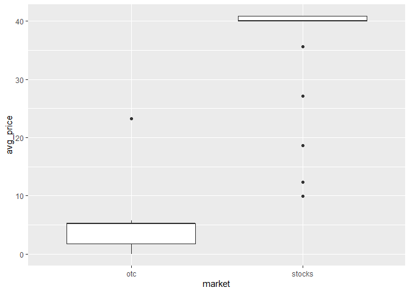<!-- -->

``` r
h + geom_boxplot(aes(y = type)) + coord_flip()
```

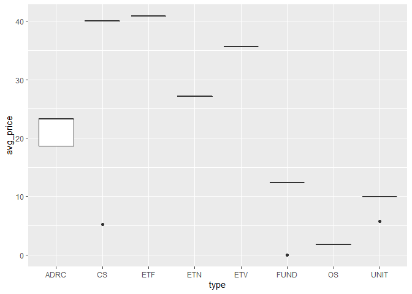<!-- -->

### Plots for modified Data - part 2

``` r
# Empirical CDF by market type - price 50% above price avg up to max price
df_filter_price = df %>%
  filter(c > 1.5*mean(df$c) & c < max(c))

h1 = ggplot(df_filter_price, aes(x = c))
h1 + stat_ecdf(geom = "step", aes(color = market)) + ylab("ECDF")
```

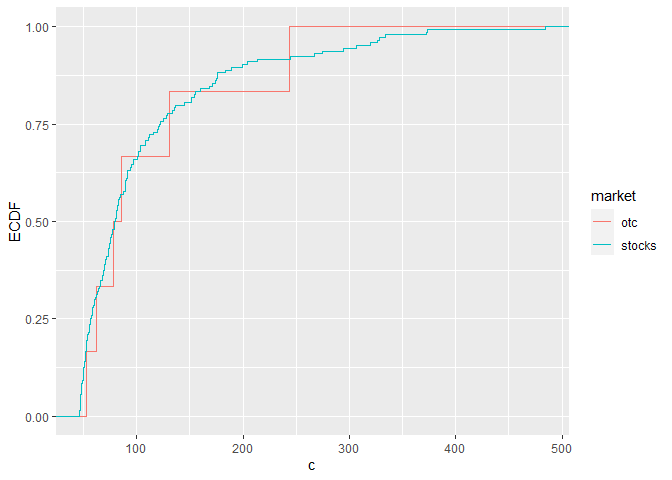<!-- -->

``` r
h1 + stat_ecdf(geom = "step", aes(color = type)) + ylab("ECDF")
```

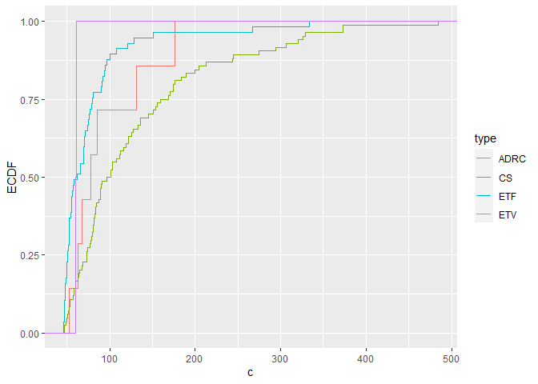<!-- -->

``` r
# histograms by market type
h1 + geom_density(adjust = 0.5, alpha = 0.5, aes(fill = market))
```

<!-- -->

``` r
h1 + geom_density(adjust = 0.5, alpha = 0.5, aes(fill = type))
```

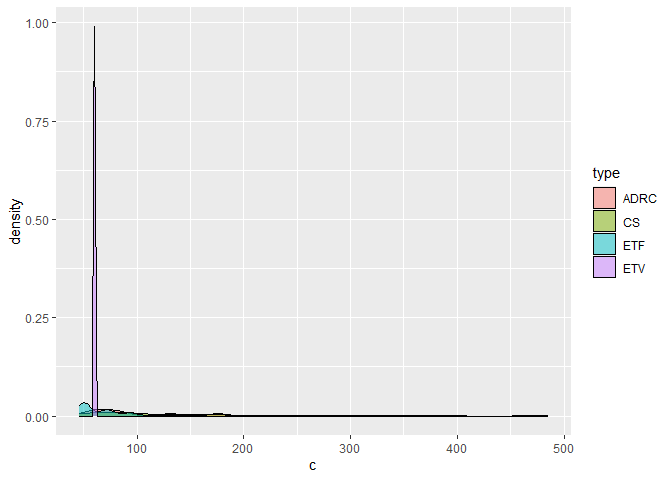<!-- -->

``` r
# histogram + density plot for closed price by market type
h1 + geom_histogram(aes(fill = market, y = ..density..), position = "dodge") + 
  geom_density(adjust = 0.5, alpha = 0.5, aes(fill = market))
```

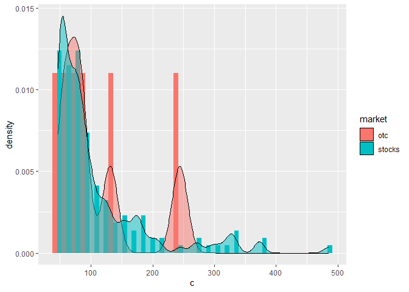<!-- -->

``` r
h1 + geom_histogram(aes(fill = type, y = ..density..), position = "dodge") + 
  geom_density(adjust = 0.5, alpha = 0.5, aes(fill = type))
```

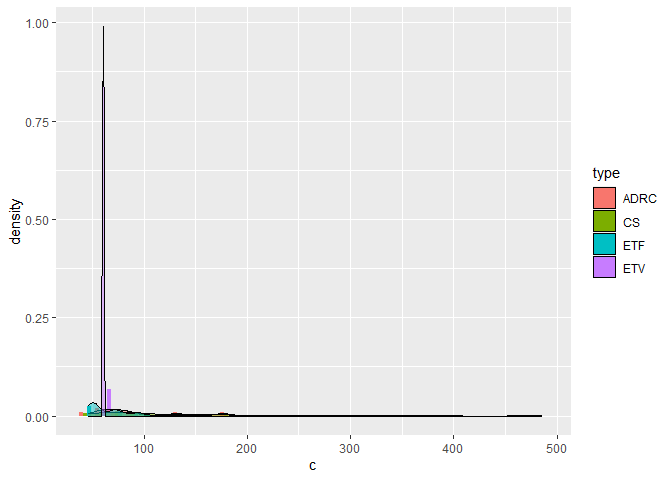<!-- -->

``` r
# scatter plot
h1 + geom_point(aes(y = h)) + facet_wrap(~market)
```

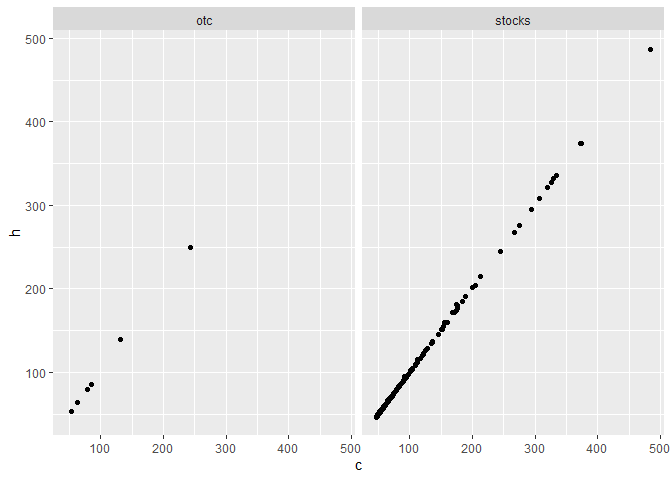<!-- -->

``` r
h1 + geom_point(aes(y = h)) + facet_wrap(~type)
```

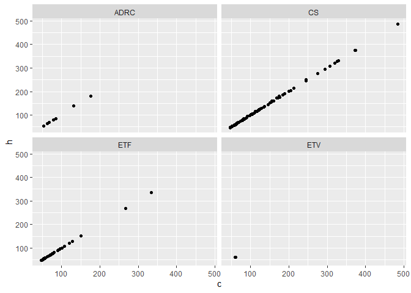<!-- -->

## For time data

``` r
# for either categorical, numerical, and timely EDa
g <- ggplot(time_df, aes(y = c, color = tckr))
g + geom_line(aes(x = d, color = tckr),lwd = 1.5)
```

<!-- -->

``` r
# scatter plot + curve
g + geom_point(aes(x = d)) + geom_smooth(method = "gam", aes(x = d))
```

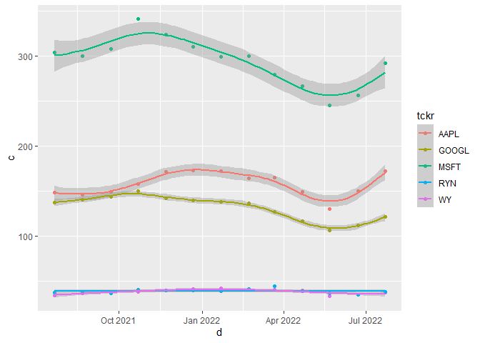<!-- -->
