Project 2T
================
Cassio Monti & Smitali Patnaik
10-08-2022

# Required Packages

Some packages necessary to run the code

``` r
# Getting relevant packages and calling the api
library(jsonlite)
library(tidyverse)
```

# Key Usage

Defining the keys used due to limited access.

``` r
key_id = c("foHUdTopBg22FTwv4b11YQsLuZXQkALG",
           "asWU9di2FThCr1ywIpgyNdqwXMf0fpj4","NrFY1wYudADe_0JmFFQAVxPFzuhritoB")
```

# Functions for Calling the API via EndPoints

There are two functions so far, the first pull down the aggregate
information about the tickers with some metrics. The second function
pull down the ticker names and some characteristics as location, ticker
type, and more.

## Aggregate EndPoint

For time data and time EDA

``` r
# create the URL for aggregate endpoint:
# This function has some default values.
agg_endpoint = function(stocksTicker="AAPL", from = "2021-07-22", to = "2022-07-22",mltplr=30, timespan="day", ky, ...){

  # passing the components of the URL for the API:
  # base + endpoint 1
  base_endpoint = "https://api.polygon.io/v2/aggs/"
  
  # last part of the URL defining some defaults
  last_code = "?adjusted=true&sort=asc&limit=5000"
  
  # key for accessing API
  key = paste0("&apiKey=", key_id[ky])
  
  # converting the multiplier to character
  mltplr = as.character(mltplr)
  
  # creating the URL call
  call = paste0(base_endpoint,"ticker/",stocksTicker,"/range/",mltplr,"/",
                timespan,"/",from,"/",to,last_code,key)
  
  # assigning the call to an object
  p = fromJSON(call)

  # getting results from the object
  tb = p$results
  tckr = p$ticker
  
  # working with the dates
  d1 = as.Date(from) # transforms initial date from char to date format
  d2 = as.Date(to) # transforms last date from char to date format
  d = seq(d1,d2, by ="month") # sequence by month
  
  # combining the final object with ticker name, date, and metrics
  out = tibble(tckr,d,tb)
  
  # returning the final tibble object
  return(out)
  
}
```

## Grouped Daily EndPoints

For merging with the ticker endpoint data set and go to the EDA.

``` r
grouped_endpoint = function(date= "2022-07-14", adjusted = "true", otc = "true", ky, ...){
  
  adjusted = tolower(adjusted)
  
  # base + endpoint 1
  base="https://api.polygon.io/v2/aggs/grouped/locale/us/market/stocks/"
  
  # key for accessing API
  key = paste0("&apiKey=", key_id[ky])
  
  # creating the URL call
  call = paste0(base,date,"?adjusted=",adjusted,"&include_otc=",otc,key)
  
  # assigning the call to an object
  p = fromJSON(call)

  out = tibble(p$results)
  
  return(out)
}
```

``` r
macd_endpoint = function(stocksTicker="AAPL", date = "2022-07-22", ky, ..) {
# base + endpoint 1
  base="https://api.polygon.io/v1/indicators/macd/"
  
  # key for accessing API
  key = paste0("&apiKey=", key_id[ky])
  
  # creating the URL call
  call = paste0(base,stocksTicker,"?timestamp=",date,"&timespan=hour&adjusted=true&short_window=12&long_window=26&signal_window=9&series_type=close&order=desc",key)
  
  
  # assigning the call to an object
  p = fromJSON(call)
  outd = tibble(p$results$values)
  
  return(outd)
}
```

## Ticker EndPoint

This function aims to call tickers from common stock mainly and other
markets as well as crypto currencies for further analysis of both.

``` r
# tickers endpoint= get ticker names
# create the URL for the ticker endpoint - two calls: i) ticker names; and
# ii) otc names
ticker_endpoint = function(type = NULL, market = "stocks", limit = 1000, ticker = NULL, ky, ...){
  

  if(limit > 1000){
    limit = 1000
    message("Warning: the max limit is 1000 for free access!")
  }

  last_code = "&active=true&sort=locale&order=asc&limit="
  
  key = paste0("&apiKey=", key_id[ky])

    
  if(!is.null(ticker)){
    
      base_endpoint = "https://api.polygon.io/v3/reference/tickers?ticker="
      
      call = paste0(base_endpoint,ticker)

  }else{
    
      base_endpoint = "https://api.polygon.io/v3/reference/tickers?market="
      
      market = tolower(market)
      
      call = paste0(base_endpoint,market)

  }
  
  if(!is.null(type)){
    
    type = tolower(type)
    
    tp = switch(type,
               "common stock" = "CS",
               "investment fund" = "FUND",
               "exchanged-traded fund" = "ETF",
               "standard & poors" = "SP",
                stop("This is not one of the allowed options!"))
    
    call = paste0(call, "&type=", tp, last_code, limit, key)
    
  }else{
    
    call = paste0(call, last_code, limit, key)
    
  }

  p = fromJSON(call)
  
  return(p$results)

}
```

## Wrapper Function

This function takes information from the previous two functions and
combine them when it is possible.

``` r
# ticker vector to call the API
tickers = c("AAPL","GOOGL", "MSFT","WY","RYN")

# calling the full name of the companies
CompanyName = sapply(tickers, function(x){
  return(ticker_endpoint(ticker = x, ky = 1)$name)
})

# call multiple tickers from agg_endpoint and return sa df
agg_data = lapply(tickers, agg_endpoint, ky = 1)

Combining_calls = function(tickerID, ...){
  
  # grouping quantitative EDA data - time analysis
  time_df = lapply(1:length(agg_data), function(x){
    
    return(cbind(Company_Name = CompanyName[x], agg_data[[x]]))
  })
  
  time_df <- do.call("rbind", time_df)
  
  time_df = as_tibble(time_df)
  
  
  # grouping categorical EDA data
  tout = ticker_endpoint(market = "stocks", limit = 1000, ky=2)

  tout2 = ticker_endpoint(market = "otc", limit = 1000, ky=2)
  
  gout = grouped_endpoint(otc = "true",ky=2)

  df1 = inner_join(tout2, gout, by = c("ticker" = "T"))

  df11= df1 %>%
  select(ticker, name, market, type, composite_figi,share_class_figi, v:n)

  df2 = inner_join(tout, gout, by = c("ticker" = "T"))

  df22 = df2 %>%
    select(ticker, name, market, type,composite_figi,share_class_figi, v:n)

  df = rbind(df11, df22)

  df = df %>% drop_na()
  
  #### macd data
  
  macd_data = lapply(tickers, macd_endpoint, ky = 3)
  macd_df = lapply(1:length(macd_data), function(x){
    return(cbind(Company_Name = CompanyName[x], macd_data[[x]]))
  
    })
  
  macd_df <- do.call("rbind", macd_df)
  macd_df = as_tibble(macd_df)
  return(list(df = df, time_df = time_df,macd_df=macd_df))
  
}

out = Combining_calls(tickerID = tickers)
df = out$df
time_df = out$time_df

macd_df=out$macd_df
macd_df
```

    ## # A tibble: 50 × 5
    ##    Company_Name     timestamp  value signal histogram
    ##    <chr>                <dbl>  <dbl>  <dbl>     <dbl>
    ##  1 Apple Inc.   1658530800000 0.0313  0.257   -0.226 
    ##  2 Apple Inc.   1658527200000 0.0752  0.314   -0.238 
    ##  3 Apple Inc.   1658523600000 0.124   0.373   -0.249 
    ##  4 Apple Inc.   1658520000000 0.179   0.435   -0.256 
    ##  5 Apple Inc.   1658516400000 0.221   0.499   -0.279 
    ##  6 Apple Inc.   1658512800000 0.287   0.569   -0.282 
    ##  7 Apple Inc.   1658509200000 0.403   0.640   -0.237 
    ##  8 Apple Inc.   1658505600000 0.523   0.699   -0.176 
    ##  9 Apple Inc.   1658502000000 0.616   0.743   -0.127 
    ## 10 Apple Inc.   1658498400000 0.716   0.775   -0.0582
    ## # … with 40 more rows

# EDA

## For several tickers

### Plots for raw data

``` r
# for categorical and numerical EDA
df
```

    ## # A tibble: 871 × 14
    ##    ticker name   market type  compo…¹ share…²      v      vw       o       c       h
    ##    <chr>  <chr>  <chr>  <chr> <chr>   <chr>    <dbl>   <dbl>   <dbl>   <dbl>   <dbl>
    ##  1 FBMCF  BUFFA… otc    OS    BBG000… BBG001… 1.86e3 9.5 e-3 9.5 e-3 9.5 e-3 9.5 e-3
    ##  2 CNTMF  CANSO… otc    OS    BBG00N… BBG00N… 7.88e4 1.95e-1 2   e-1 1.9 e-1 2.05e-1
    ##  3 BCMRF  BCM R… otc    OS    BBG000… BBG001… 8.02e4 1.28e-1 1.22e-1 1.28e-1 1.3 e-1
    ##  4 CRMK   CERME… otc    CS    BBG000… BBG001… 2   e3 2   e-2 2   e-2 2   e-2 2   e-2
    ##  5 HEOFF  H2O I… otc    OS    BBG000… BBG001… 4.12e3 1.51e+0 1.45e+0 1.54e+0 1.54e+0
    ##  6 BDWBY  BUDWE… otc    ADRC  BBG00Q… BBG00Q… 7.36e3 1.13e+1 1.14e+1 1.12e+1 1.14e+1
    ##  7 HKMPY  HIKMA… otc    ADRC  BBG000… BBG001… 1.58e3 3.99e+1 3.94e+1 3.97e+1 4.05e+1
    ##  8 MKRYF  MANIT… otc    OS    BBG001… BBG001… 5.1 e2 1   e-5 1   e-5 1   e-5 1   e-5
    ##  9 ECAOF  ECO A… otc    OS    BBG000… BBG001… 2.7 e3 3.65e-1 3.61e-1 3.75e-1 3.75e-1
    ## 10 NHMD   NATE'… otc    CS    BBG000… BBG001… 1.89e7 1.46e-3 1.6 e-3 1.4 e-3 1.7 e-3
    ## # … with 861 more rows, 3 more variables: l <dbl>, t <dbl>, n <int>, and
    ## #   abbreviated variable names ¹​composite_figi, ²​share_class_figi

``` r
table(df$market)
```

    ## 
    ##    otc stocks 
    ##    193    678

``` r
table(df$type)
```

    ## 
    ## ADRC   CS  ETF  ETN  ETV FUND   OS UNIT 
    ##   71  470  202    4    5   37   71   11

``` r
table(df$market, df$type)
```

    ##         
    ##          ADRC  CS ETF ETN ETV FUND  OS UNIT
    ##   otc      44  75   0   0   0    1  71    2
    ##   stocks   27 395 202   4   5   36   0    9

``` r
# type vs market
g = ggplot(df, aes(x = market))
g + geom_bar(aes(fill = type), position = "dodge")
```

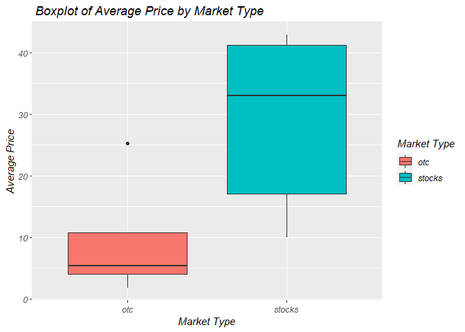<!-- -->

### Plots for modified Data - part 1

``` r
# quantitative vs market & type
# group by type and market and average
df_price = df %>% 
  group_by(market, type) %>%
  summarise(avg_price = mean(c), price_range = (h - l))

h = ggplot(df_price, aes(x = avg_price))

# histograms by market type
h + geom_density(adjust = 0.5, alpha = 0.5, aes(fill = market))
```

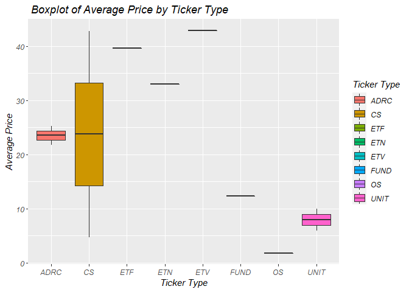<!-- -->

``` r
h + geom_density(adjust = 0.5, alpha = 0.5, aes(fill = type))
```

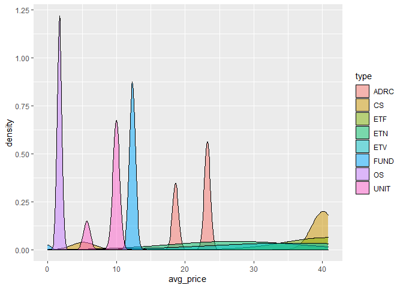<!-- -->

``` r
# histogram + density plot for closed price by market type
h + geom_histogram(aes(fill = market, y = ..density..), position = "dodge") + 
  geom_density(adjust = 0.5, alpha = 0.5, aes(fill = market))
```

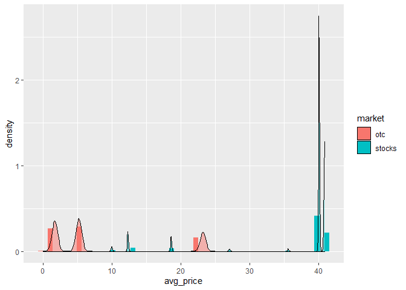<!-- -->

``` r
h + geom_histogram(aes(fill = type, y = ..density..), position = "dodge") + 
  geom_density(adjust = 0.5, alpha = 0.5, aes(fill = type))
```

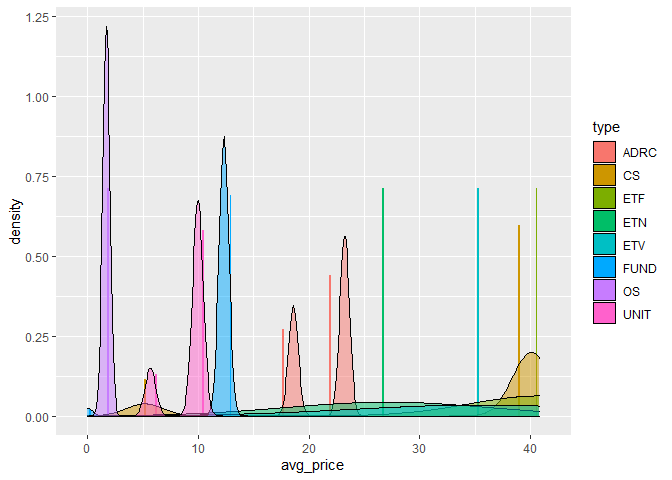<!-- -->

``` r
# boxplot by market and typer for avg price
h + geom_boxplot(aes(y = market)) + coord_flip()
```

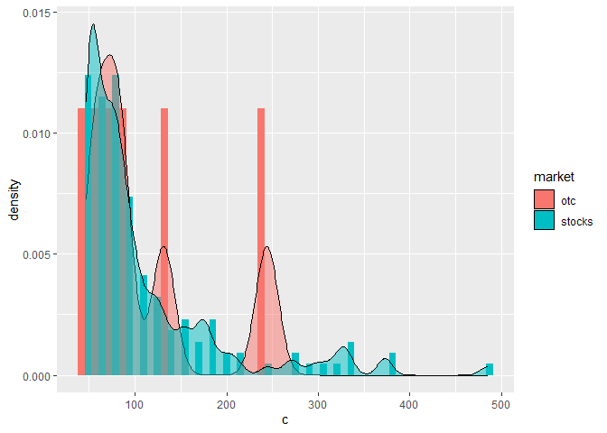<!-- -->

``` r
h + geom_boxplot(aes(y = type)) + coord_flip()
```

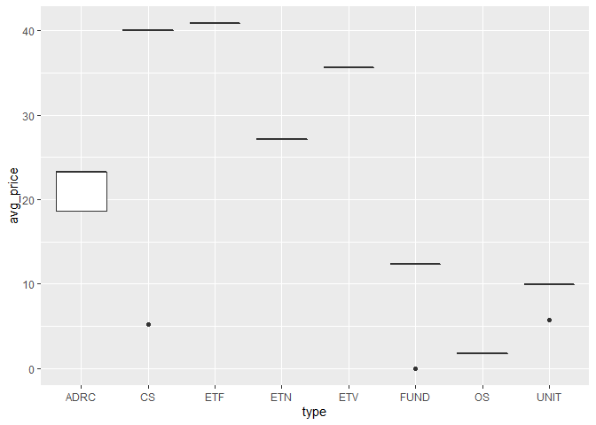<!-- -->

### Plots for modified Data - part 2

``` r
# Empirical CDF by market type - price 50% above price avg up to max price
df_filter_price = df %>%
  filter(c > 1.5*mean(df$c) & c < max(c))

h1 = ggplot(df_filter_price, aes(x = c))
h1 + stat_ecdf(geom = "step", aes(color = market)) + ylab("ECDF")
```

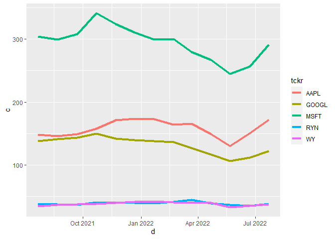<!-- -->

``` r
h1 + stat_ecdf(geom = "step", aes(color = type)) + ylab("ECDF")
```

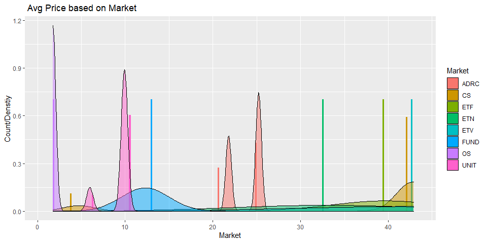<!-- -->

``` r
# histograms by market type
h1 + geom_density(adjust = 0.5, alpha = 0.5, aes(fill = market))
```

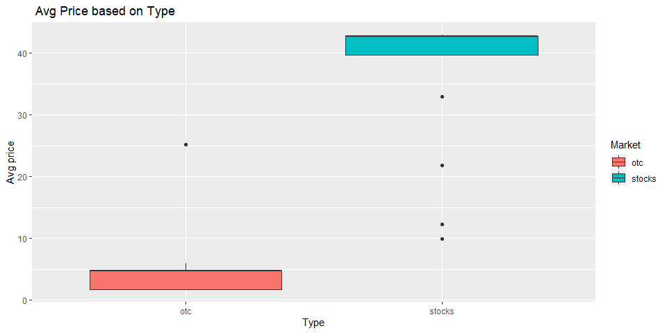<!-- -->

``` r
h1 + geom_density(adjust = 0.5, alpha = 0.5, aes(fill = type))
```

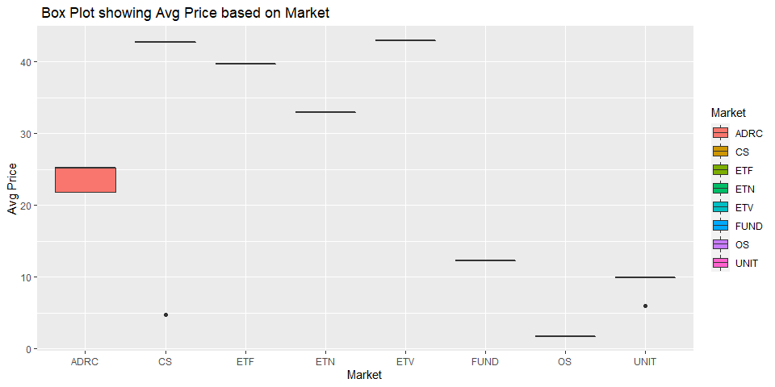<!-- -->

``` r
# histogram + density plot for closed price by market type
h1 + geom_histogram(aes(fill = market, y = ..density..), position = "dodge") + 
  geom_density(adjust = 0.5, alpha = 0.5, aes(fill = market))
```

<!-- -->

``` r
h1 + geom_histogram(aes(fill = type, y = ..density..), position = "dodge") + 
  geom_density(adjust = 0.5, alpha = 0.5, aes(fill = type))
```

<!-- -->

``` r
# scatter plot
h1 + geom_point(aes(y = h)) + facet_wrap(~market)
```

<!-- -->

``` r
h1 + geom_point(aes(y = h)) + facet_wrap(~type)
```

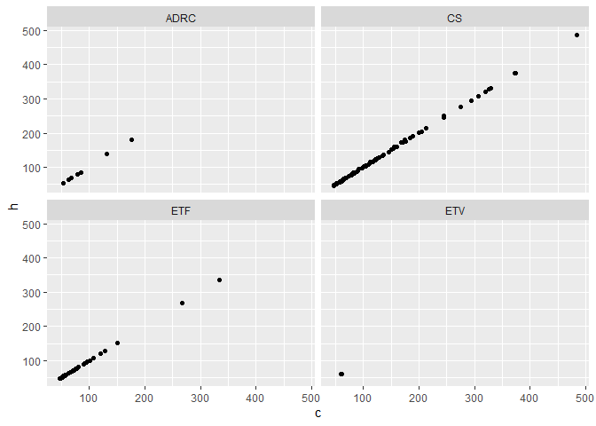<!-- -->

## For time data

``` r
# for either categorical, numerical, and timely EDa
g <- ggplot(time_df, aes(y = c, color = tckr))
g + geom_line(aes(x = d, color = tckr),lwd = 1.5)
```

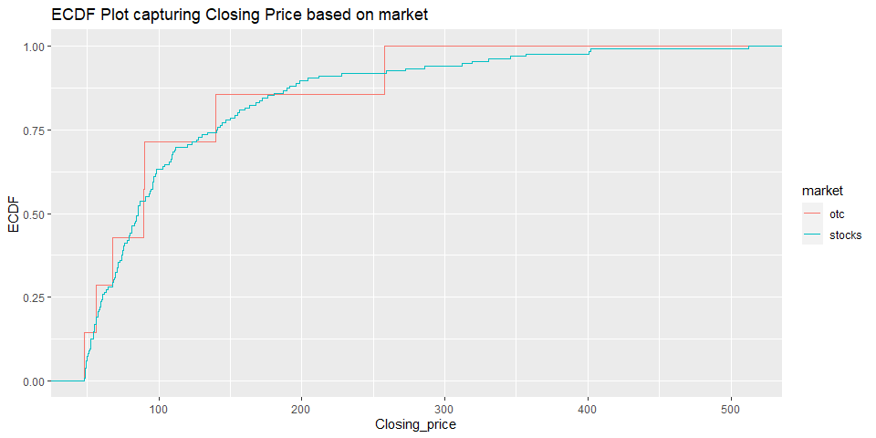<!-- -->

``` r
# scatter plot + curve
g + geom_point(aes(x = d)) + geom_smooth(method = "gam", aes(x = d))
```

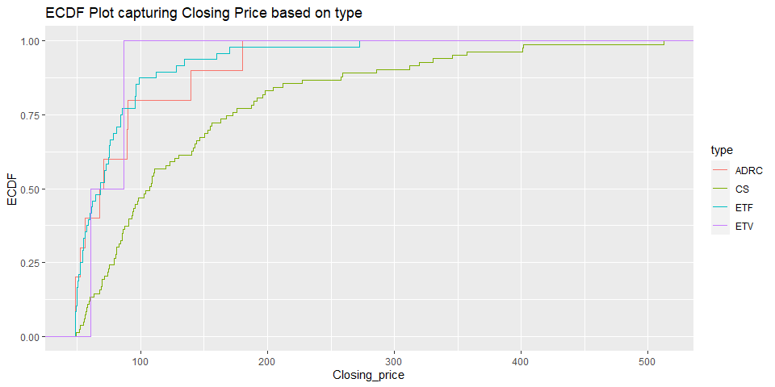<!-- -->

\###EXPLORATORY DATA ANALYSIS.

#### Data Visibility

Before proceeding to the detailed EDA of the data sets taken from the
APIs, some minor changes have been made to the data frame df. The
columns have been renamed as

c - Closing_price h - Highest_price l - Lowest_price n - Transactions
o - Open_price t - Unix_time v- Trading_volume vW- Volume_wt_avg_price

Also,the unix time format has been changed to date format.

Typical price is used to determine volume weighted price. Typical price
has been derived as sum of the closing price , highest price and lower
price.

``` r
df<-df %>% 
  rename(
    Closing_price=c,
    Highest_price=h,
    Lowest_price=l, 
    Transactions=n,
    Open_price=o, 
    Unix_time=t,
    Trading_volume=v,
    Volume_wt_avg_price=vw
   )

df<- df %>% mutate(Date= as.POSIXct(df$Unix_time/1000,origin = "1970-01-01"))
df$Date<-as.Date(df$Date)

df<- df %>% mutate(Sum_Typical_price= (Closing_price+Highest_price+Lowest_price)/3)
df
```

    ## # A tibble: 871 × 16
    ##    ticker name  market type  compo…¹ share…² Tradi…³ Volum…⁴ Open_…⁵ Closi…⁶ Highe…⁷
    ##    <chr>  <chr> <chr>  <chr> <chr>   <chr>     <dbl>   <dbl>   <dbl>   <dbl>   <dbl>
    ##  1 FBMCF  BUFF… otc    OS    BBG000… BBG001…  1.86e3 9.5 e-3 9.5 e-3 9.5 e-3 9.5 e-3
    ##  2 CNTMF  CANS… otc    OS    BBG00N… BBG00N…  7.88e4 1.95e-1 2   e-1 1.9 e-1 2.05e-1
    ##  3 BCMRF  BCM … otc    OS    BBG000… BBG001…  8.02e4 1.28e-1 1.22e-1 1.28e-1 1.3 e-1
    ##  4 CRMK   CERM… otc    CS    BBG000… BBG001…  2   e3 2   e-2 2   e-2 2   e-2 2   e-2
    ##  5 HEOFF  H2O … otc    OS    BBG000… BBG001…  4.12e3 1.51e+0 1.45e+0 1.54e+0 1.54e+0
    ##  6 BDWBY  BUDW… otc    ADRC  BBG00Q… BBG00Q…  7.36e3 1.13e+1 1.14e+1 1.12e+1 1.14e+1
    ##  7 HKMPY  HIKM… otc    ADRC  BBG000… BBG001…  1.58e3 3.99e+1 3.94e+1 3.97e+1 4.05e+1
    ##  8 MKRYF  MANI… otc    OS    BBG001… BBG001…  5.1 e2 1   e-5 1   e-5 1   e-5 1   e-5
    ##  9 ECAOF  ECO … otc    OS    BBG000… BBG001…  2.7 e3 3.65e-1 3.61e-1 3.75e-1 3.75e-1
    ## 10 NHMD   NATE… otc    CS    BBG000… BBG001…  1.89e7 1.46e-3 1.6 e-3 1.4 e-3 1.7 e-3
    ## # … with 861 more rows, 5 more variables: Lowest_price <dbl>, Unix_time <dbl>,
    ## #   Transactions <int>, Date <date>, Sum_Typical_price <dbl>, and abbreviated
    ## #   variable names ¹​composite_figi, ²​share_class_figi, ³​Trading_volume,
    ## #   ⁴​Volume_wt_avg_price, ⁵​Open_price, ⁶​Closing_price, ⁷​Highest_price

##### Contingency table - I with Bar plots.

The First contingency table states count of pooled investment based on
the market for the given ticker data set. And also graphs it in a bar
plot. This shows that there were maximum tickers for the stock market
for CS and maximum for OTC for OS. It was noted that tickers/companies
with ADRC, CS,OS and UNIT investments had both OTC markets. Rest of
tickers had just stock market based investments.

``` r
tab_cate1<-table(df$type,df$market)
tab_cate1
```

    ##       
    ##        otc stocks
    ##   ADRC  44     27
    ##   CS    75    395
    ##   ETF    0    202
    ##   ETN    0      4
    ##   ETV    0      5
    ##   FUND   1     36
    ##   OS    71      0
    ##   UNIT   2      9

``` r
g <- ggplot(data = df, aes(fill=as.factor(market),x=type))
g + geom_bar( stat = "count",position="dodge")+ labs(x = "Type of Investment", y = "Count",title=" Count of Investments based on Market")+scale_fill_discrete(name = "Market ")
```

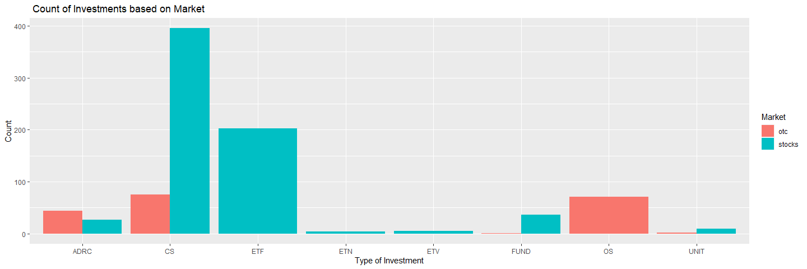<!-- -->

##### Contingency table - II

The other contingency table calculates mean of all the quantitative
parameters based on two groups- market and type . This uses group_by to
group categorical variables and mean of all the quantitative variables
are calculated for the subsequent groups.

The Trading volume was maximum for OTC/CS type tickers followed by
Stocks/ETV. The mean volume weighted price is maximum for tickers with
maximum price for the given price variables.

``` r
df_summary<-df%>% select(- c("ticker","name","composite_figi","share_class_figi","Date"))
tab_cate2<-df_summary%>% group_by(market,type) %>%  summarise_all(mean)
tab_cate2
```

    ## # A tibble: 12 × 11
    ##    market type  Trading_vo…¹ Volum…² Open_…³ Closi…⁴ Highe…⁵ Lowes…⁶ Unix_…⁷ Trans…⁸
    ##    <chr>  <chr>        <dbl>   <dbl>   <dbl>   <dbl>   <dbl>   <dbl>   <dbl>   <dbl>
    ##  1 otc    ADRC        95895. 23.3    23.3    23.2    23.7    22.9    1.66e12   214. 
    ##  2 otc    CS       23370645.  5.15    5.23    5.18    5.27    5.13   1.66e12   162. 
    ##  3 otc    FUND         1000   0.0001  0.0001  0.0001  0.0001  0.0001 1.66e12     1  
    ##  4 otc    OS          31124.  1.69    1.69    1.70    1.72    1.66   1.66e12    14.4
    ##  5 otc    UNIT        11053   5.66    5.54    5.68    5.76    5.47   1.66e12    20  
    ##  6 stocks ADRC      1582813. 18.5    18.8    18.6    19.0    18.2    1.66e12  7515. 
    ##  7 stocks CS        1294453. 39.9    39.9    40.1    40.5    39.2    1.66e12 10514. 
    ##  8 stocks ETF        674363. 40.7    40.6    40.9    41.0    40.4    1.66e12  3236. 
    ##  9 stocks ETN         67163  26.9    26.9    27.1    27.4    26.6    1.66e12   171  
    ## 10 stocks ETV       6779599. 35.5    35.5    35.6    35.8    35.2    1.66e12  8313. 
    ## 11 stocks FUND        68898. 12.3    12.3    12.3    12.4    12.2    1.66e12   321. 
    ## 12 stocks UNIT         1695.  9.97    9.97    9.97    9.99    9.96   1.66e12    15.9
    ## # … with 1 more variable: Sum_Typical_price <dbl>, and abbreviated variable names
    ## #   ¹​Trading_volume, ²​Volume_wt_avg_price, ³​Open_price, ⁴​Closing_price,
    ## #   ⁵​Highest_price, ⁶​Lowest_price, ⁷​Unix_time, ⁸​Transactions

##### Scatter Plot

The chart below shows the correlation between the open price and the
volume weighted average price. This chart chart simply establishes the
fact that vW or volume weighted price is derived from the closing price,
highest and lowest price. And this is bound to be linear relation for
every ticker. The correlation calculated was 0.999907.

``` r
correlation<-cor(df$Volume_wt_avg_price,df$Open_price)
correlation
```

    ## [1] 0.999907

``` r
g <- ggplot(data =df, aes(x=Volume_wt_avg_price,y=Closing_price))
g + geom_point(color="red") + geom_smooth(method=lm, fullrange=FALSE)+labs(x= "Closing Price", y= "Volume Weighted Price" ,title ="Closing Price  vs Weighted Average Price")
```

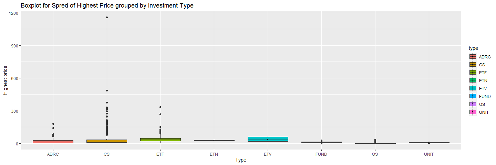<!-- -->

#### Box Plot for Highest Price based on Investment type

For the given day the Range of Highest price based on Investment type
are summarized through the bar graphs. The CS investment type shows an
outlier of \~\$1100 . The mean is maximum for ETV type.

``` r
g <- ggplot(data = df, aes(x=type,y=Highest_price,fill=type))
g + geom_boxplot()+ stat_summary(fun = mean,
lwd = 0.05,aes(group = type))+labs(x="Type" ,y= "Highest price",title ="Boxplot for Spred of Highest Price grouped by Investment Type ")
```

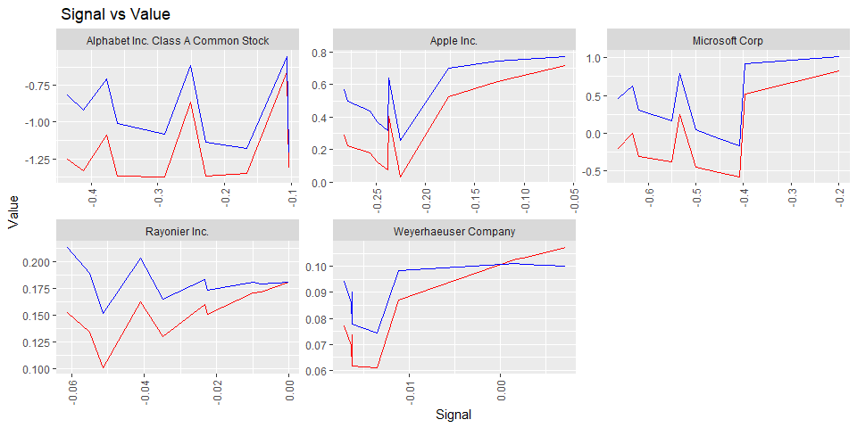<!-- -->

The histogram is for looking the frequency of the transactions for each
group of market for the given time period. The total count of count of
transactions less \< 1000 are maximum for both market types. And hence,
the plot is skewed to the left.

``` r
ggplot(df,aes(x=Transactions,fill=market)) + geom_histogram( position="dodge")+labs(x="Transactions" ,y= "Count ",title ="Histogram of Number of transactions grouped by Market ")
```

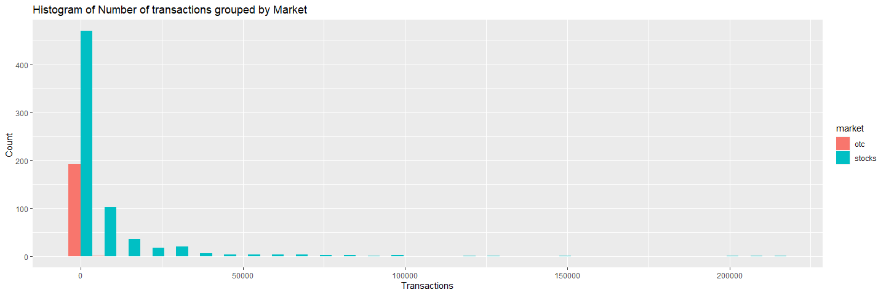<!-- -->

#### Time_df

Similar , excercise has been implemented for this dataframe as well.
Where the columns have been renamed to easiliy identify the variables.

``` r
time_df<-time_df %>% 
  rename(
    Closing_price=c,
    Highest_price=h,
    Lowest_price=l, 
    Transactions=n,
    Open_price=o, 
    Unix_time=t,
    Trading_volume=v,
    Volume_wt_avg_price=vw,
    Date=d
   )

time_df
```

    ## # A tibble: 65 × 11
    ##    Compan…¹ tckr  Date       Tradi…² Volum…³ Open_…⁴ Closi…⁵ Highe…⁶ Lowes…⁷ Unix_…⁸
    ##    <chr>    <chr> <date>       <dbl>   <dbl>   <dbl>   <dbl>   <dbl>   <dbl>   <dbl>
    ##  1 Apple I… AAPL  2021-07-22  1.58e9    147.    146.    148.    152.    143. 1.63e12
    ##  2 Apple I… AAPL  2021-08-22  1.51e9    151.    148.    146.    157.    146. 1.63e12
    ##  3 Apple I… AAPL  2021-09-22  1.73e9    143.    144.    149.    149.    138. 1.63e12
    ##  4 Apple I… AAPL  2021-10-22  1.52e9    151.    149.    158.    159.    146. 1.63e12
    ##  5 Apple I… AAPL  2021-11-22  2.48e9    169.    158.    171.    182.    156. 1.64e12
    ##  6 Apple I… AAPL  2021-12-22  1.60e9    175.    168.    173.    183.    167. 1.64e12
    ##  7 Apple I… AAPL  2022-01-22  2.17e9    168.    172.    173.    177.    155. 1.64e12
    ##  8 Apple I… AAPL  2022-02-22  2.01e9    161.    171.    164.    172.    150. 1.65e12
    ##  9 Apple I… AAPL  2022-03-22  1.60e9    172.    164.    165.    180.    163. 1.65e12
    ## 10 Apple I… AAPL  2022-04-22  2.34e9    156.    164.    149.    172.    139. 1.65e12
    ## # … with 55 more rows, 1 more variable: Transactions <int>, and abbreviated
    ## #   variable names ¹​Company_Name, ²​Trading_volume, ³​Volume_wt_avg_price,
    ## #   ⁴​Open_price, ⁵​Closing_price, ⁶​Highest_price, ⁷​Lowest_price, ⁸​Unix_time

#### Summary Table

This table summarizes the means of the pricing, transactions and volume
for the select technology and timberland companies. There is no relation
b/w two industries but this data is pretty obvious that the Tech giants
price more and have bigger penetration in the trading business. Majority
of these companies have world-wide presence compare to timberland
companies. These tech giants have net worth approx in billions and
having a price in the range of \$ 100+ for given time period is not
surprising. Apple is the company having highest trading volume and
Microsoft had the highest average prices for the given time range.

``` r
time_df_summary<- select(time_df, -c( "tckr","Date"))
time_df_summary<-time_df_summary %>% group_by(Company_Name) %>% summarize_all(mean)
time_df_summary
```

    ## # A tibble: 5 × 9
    ##   Company_Name       Tradi…¹ Volum…² Open_…³ Closi…⁴ Highe…⁵ Lowes…⁶ Unix_…⁷ Trans…⁸
    ##   <chr>                <dbl>   <dbl>   <dbl>   <dbl>   <dbl>   <dbl>   <dbl>   <dbl>
    ## 1 Alphabet Inc. Cla…  7.01e8   131.    131.    131.    139.    123.  1.64e12  2.79e6
    ## 2 Apple Inc.          1.80e9   157.    155.    158.    166.    147.  1.64e12  1.42e7
    ## 3 Microsoft Corp      6.07e8   294.    292.    294.    309.    277.  1.64e12  8.06e6
    ## 4 Rayonier Inc.       1.16e7    38.5    38.3    38.5    40.8    36.0 1.64e12  1.43e5
    ## 5 Weyerhaeuser Comp…  8.32e7    37.6    37.3    37.8    39.4    35.4 1.64e12  6.77e5
    ## # … with abbreviated variable names ¹​Trading_volume, ²​Volume_wt_avg_price,
    ## #   ³​Open_price, ⁴​Closing_price, ⁵​Highest_price, ⁶​Lowest_price, ⁷​Unix_time,
    ## #   ⁸​Transactions

##### Bar Plot with Facet Wrap.

The Mean of transactions grouped by Industry type has been shown below
as we have 3 technology companies and 2 timberland companies selected
for the subplots. This shows again transaction wise Technology companies
have a higher trend. In the month of Jan 2022 Technology companies had
maximum transactions with timberland showing higher numbers in the month
of April.

``` r
time_df2<-time_df%>% mutate(Industry='Technology')
time_df2$Industry <-ifelse(time_df2$tckr=="WY" | time_df2$tckr=="WY" , "Finance", "Technology")

ggplot(time_df2, aes(x=as.factor(Date), y=Transactions,fill=Industry))+ geom_bar( stat = "summary", fun.y = "mean")+ facet_wrap(~Industry,  nrow=2 )+guides(x = guide_axis(angle = 90))+ labs(x= "Transactions", y= "Date",title=" Mean Transactions for the time period grouped by Industry type")+scale_fill_discrete(name = "Industry Type ")
```

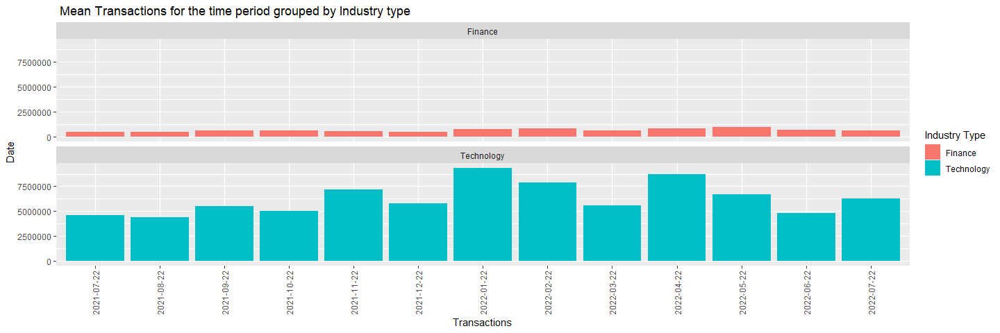<!-- -->

#### Line Plots

The Volume weighted price trend has been captured in the below plot for
each company. Apple as expected showing highest trends line. It saw
lowest numbers in the Jul 2021 and again in Jul 2022. It is interesting
to note all technology companies saw peaks in the month of Nov 2021, Jan
2022 and Apr 2022

``` r
ggplot(time_df2, aes(x = Date, y = Transactions, colour =Company_Name, group = Company_Name)) +geom_line() + geom_point()+labs(x= "Date", y= "Volume Weighted Average Price",title=" Volume weighted price for the time range grouped by Companies")
```

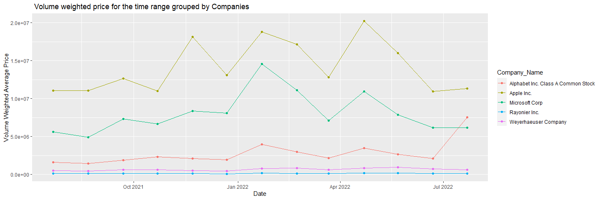<!-- -->

#### Scatter Plot.

The Volume of trades vs transactions can be looked into to find a
relation. We see that for every company the relation is closely linear.
So as the Transactions increase we also see growth in trading volume.

``` r
g <- ggplot(data =time_df2, aes(x=Transactions,y=Trading_volume,colour=Company_Name))
g + geom_point() +labs(x= "Trading Volume", y= "Transactions" ,title ="Trading Volume vs Transactions grouped by Companies")
```

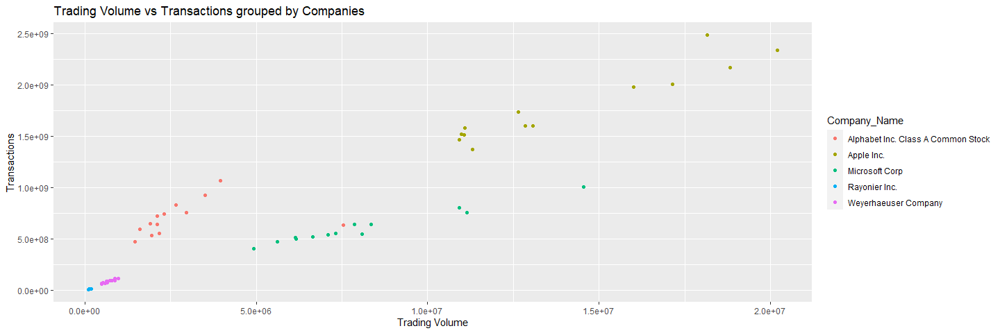<!-- -->

\####TEST API

A bullish crossover occurs when the MACD turns up and crosses above the
signal line. A bearish crossover occurs when the MACD turns down and
crosses below the signal line.

The relation between two helps determining if stock can be bought or
not.

``` r
macd_df
```

    ## # A tibble: 50 × 5
    ##    Company_Name     timestamp  value signal histogram
    ##    <chr>                <dbl>  <dbl>  <dbl>     <dbl>
    ##  1 Apple Inc.   1658530800000 0.0313  0.257   -0.226 
    ##  2 Apple Inc.   1658527200000 0.0752  0.314   -0.238 
    ##  3 Apple Inc.   1658523600000 0.124   0.373   -0.249 
    ##  4 Apple Inc.   1658520000000 0.179   0.435   -0.256 
    ##  5 Apple Inc.   1658516400000 0.221   0.499   -0.279 
    ##  6 Apple Inc.   1658512800000 0.287   0.569   -0.282 
    ##  7 Apple Inc.   1658509200000 0.403   0.640   -0.237 
    ##  8 Apple Inc.   1658505600000 0.523   0.699   -0.176 
    ##  9 Apple Inc.   1658502000000 0.616   0.743   -0.127 
    ## 10 Apple Inc.   1658498400000 0.716   0.775   -0.0582
    ## # … with 40 more rows

``` r
g <- ggplot(data =macd_df, aes(x=signal,y=value))
g + geom_point(color="red") + facet_wrap(~Company_Name)+guides(x = guide_axis(angle = 90))+ labs(x= "Signal", y= "Value",title=" Signal vs Value")+scale_fill_discrete(name = "Company Name ")
```

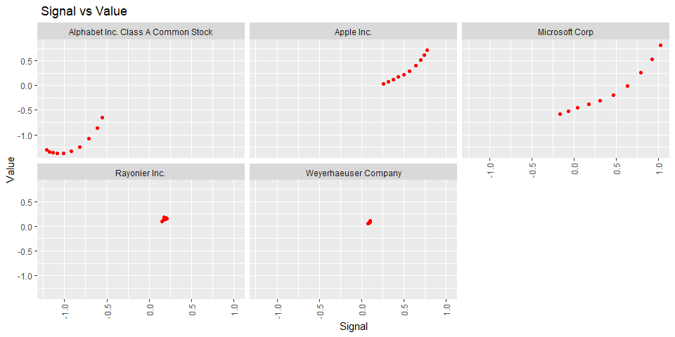<!-- -->
