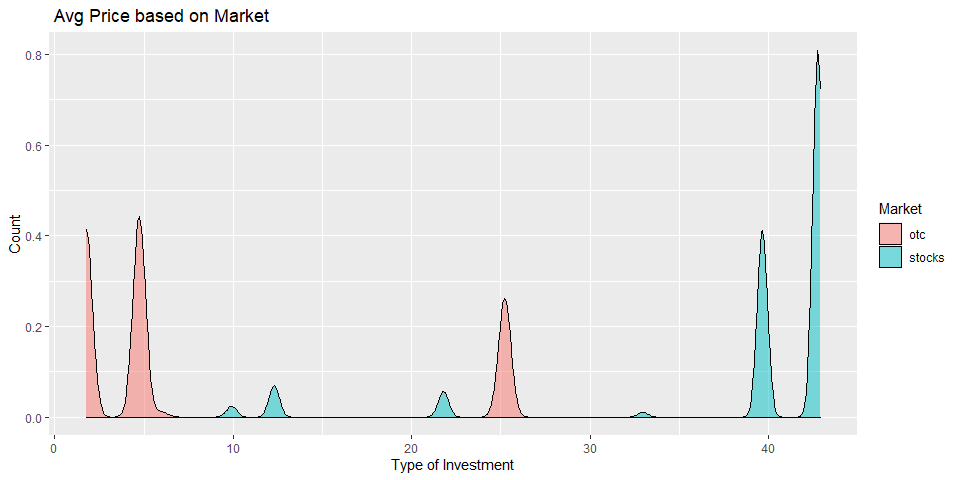

Project 2T - Working with Financial Data API
================
Cassio Monti & Smitali Patnaik
10/12/2022

-   <a href="#goal-and-specifications" id="toc-goal-and-specifications">Goal
    and Specifications</a>
-   <a href="#required-packages" id="toc-required-packages">Required
    Packages</a>
-   <a href="#api-querying-functions" id="toc-api-querying-functions">API
    Querying Functions</a>
    -   <a href="#aggregate-endpoint" id="toc-aggregate-endpoint">Aggregate
        EndPoint</a>
    -   <a href="#grouped-daily-endpoint"
        id="toc-grouped-daily-endpoint">Grouped Daily EndPoint</a>
    -   <a href="#technical-indicators-endpoint"
        id="toc-technical-indicators-endpoint">Technical Indicators EndPoint</a>
    -   <a href="#ticker-endpoint" id="toc-ticker-endpoint">Ticker EndPoint</a>
    -   <a href="#wrapper-function" id="toc-wrapper-function">Wrapper
        Function</a>
-   <a href="#eda" id="toc-eda">EDA</a>
    -   <a href="#summary-wrapper-function"
        id="toc-summary-wrapper-function">Summary Wrapper Function</a>
    -   <a href="#for-several-tickers-data---df"
        id="toc-for-several-tickers-data---df">For several tickers data - df</a>
        -   <a href="#modified-data-and-related-plots"
            id="toc-modified-data-and-related-plots">Modified Data and Related
            Plots.</a>
-   <a href="#timeseries-data-frame--time_df"
    id="toc-timeseries-data-frame--time_df">Timeseries Data frame-
    Time_df</a>

# Goal and Specifications

The main goal of this vignette is to provide a set of functions that may
assist in accessing specific information contained in the [Financial
API](https://polygon.io/docs/stocks). These functions aim to provide
data sets for further exploratory data analysis (EDA).  
The companies selected for this analysis belong to two major groups,
technology and real-state companies of the interest of the authors of
this vignette. The companies related to the technology group are Apple,
Microsoft, and Google. The companies related to real-state group are
Weyerhaeuser and Rayonier, both are timberland investment groups.  
Four functions were created querying data from 4 end points, or
searching keywords, present in the the API. Further, three data sets
were created and the EDA was executed for each of them separately. The
EDA encompassed categorical and quantitative analyses, numerical and
graphical, for each data according to their relevance to the
[objective](#eda) of this analysis.  
In order for this analysis to happen, some initial contact with the API
and an access key are required.

# Required Packages

Some packages are necessary to run the code throughout this vignette.
They are related to reading and parsing the API format, JSON format, to
a more friendly and simplified view scheme, rectangular format, through
the `jsonlite` package. The widely used `tidyverse` for data management,
specifically using `dplyr`, for nice correlation plots, `corrplot`, and
for nice table printing, `knitr`.

-   [jsonlite](https://cran.r-project.org/web/packages/jsonlite/):
    Performs the interaction between R and the API that uses the JSON
    file format.

-   [tidyverse](https://www.tidyverse.org/): This package loads several
    other packages with several useful functions addressing data
    management, reshaping, reading, plotting and some more.

-   [corrplot](https://cran.r-project.org/web/packages/corrplot/vignettes/corrplot-intro.html):
    This package has specific functions to display correlations among
    variables in a data set as intuitive plots.

-   [knitr](https://cran.r-project.org/web/packages/knitr/index.html):
    provides nice table printing formats, mainly for the contingency
    tables used herein.

# API Querying Functions

There are four functions that are responsible for querying specific
information from the mentioned financial API. The first function queries
data from the *Aggregate endpoint*, which collects mainly price metrics
for a single ticker over a pre-defined period of time. The second
function, *Grouped endpoint*, queries prices related metrics for all
tickers in a particular day. The function *Technical Indicator
endpoint*, queries information corresponding to the moving average
convergence/divergence (macd) and its related metrics. The forth, and
last function, *ticker endpoint*, queries the overall information about
the tickers, for instance, official names, country of origin, type of
market, and others.  
As operating specificity, the *ticker* and *grouped* endpoints are
working together to unify overall information about the tickers and
price related metrics in a single data set. Additionally, *ticker* and
*aggregate* endpoints are working together for the same purpose, but, in
this case, returning a timely dependent data set.

The function querying the *Technical Indicator endpoint* extracts
information for a single ticker and works with *ticker endpoint* to get
the historical ‘macd’ information with other details included.

## Aggregate EndPoint

This function takes some modifiers defined in the financial API as the
ticker ID `stocksTicker` (default is “Apple”), the time frame arguments
`from` and `to` (these arguments have default values corresponding to
one year period from July 22nd 2021 to July 22nd 2022), the `multiplier`
(default is 30) is the value associated to the `timespan` (default is
“day”) argument and they both together define the time frame in which
the ticker will be obtained. For instance, if `timespan` is “minute” and
multiplier is 1, then the returned data set will be aggregated every
1-minute interval across the time frame selected in `from` and `to`
arguments. Also, `ky` (to define the key ID for the call) is an
argument.  
This function takes all these arguments and passes them to the text
format through the function `paste0()` associating each element of the
URL required to form the query string that goes to the API. The parts of
this URL are the `base_endpoint` (provides initial piece of the URL with
the endpoint call), `last_code` (provides some other modifiers that are
not going to be considered in this function as arguments), and `key`
(provides the key ID to access the API - since API has a limited free
version, more keys are necessary to run a more complex query analysis),
besides the input arguments which are all required. It is important to
notice that this function, and the ones that use single input for
company names, have the input `stocksTicker` as the full name of the
listed company, for example, “Apple” should be provided instead of
“AAPL”. The same for “Microsoft”, “Google”, “Weyerhaeuser”, and
“Rayonier”. Therefore, it was used the function `tolower()` to return
the lower case of the name of the company to avoid errors due to
matching. Associated to the latter function, the `switch()` function
assigns the specific company name to the ticker symbol.  
The function `fromJSON()` has the URL call as input and returns a
simplified object that can be stored as a data frame. The arguments
`from` and `to` are converted into date format and then, through the
function `as.Date()` and `seq()`, a monthly vector is created and joint
with the “results” and “ticker”, from the `fromJSON()`, using `tibble()`
function. The function is defined below.

``` r
# create the URL for aggregate endpoint:
# This function has some default values.
agg_endpoint = function(stocksTicker="Apple Inc.", from = "2021-07-22", to = "2022-07-22",mltplr=30, timespan="day", ky, ...){

  # converting the full name into the ticker symbol
  stocksTicker = switch(tolower(stocksTicker),
                        "apple" = "AAPL",
                        "google" = "GOOGL",
                        "microsoft" = "MSFT",
                        "weyerhaeuser" = "WY",
                        "rayonier" = "RYN",
                        stop("You are allowed to call only a limited number of companies: Apple, GOOGLE, Microsoft, Weyerhaeuser, Rayonier!"))
  
  # passing the components of the URL for the API:
  # base + endpoint 1
  base_endpoint = "https://api.polygon.io/v2/aggs/"
  
  # last part of the URL defining some defaults
  last_code = "?adjusted=true&sort=asc&limit=5000"
  
  # key for accessing API
  key = paste0("&apiKey=", key_id[ky])
  
  # converting the multiplier to character
  mltplr = as.character(mltplr)
  
  # creating the URL call
  call = paste0(base_endpoint,"ticker/",stocksTicker,"/range/",mltplr,"/",
                timespan,"/",from,"/",to,last_code,key)
  
  # assigning the call to an object
  p = fromJSON(call)

  # getting results from the object
  tb = p$results
  tckr = p$ticker
  
  # working with the dates
  d1 = as.Date(from) # transforms initial date from char to date format
  d2 = as.Date(to) # transforms last date from char to date format
  d = seq(d1,d2, by ="month") # sequence by month
  
  # combining the final object with ticker name, date, and metrics
  out = tibble(tckr,d,tb)
  
  # returning the final tibble object
  return(out)
  
}
```

## Grouped Daily EndPoint

This end point returns price related metrics for all tickers in a
particular date. This end point is important to provide data for
analyzing the frequency of tickers by available market type and ticker
type. The function has some inputs: `date` (a specific day for which the
user is interested in knowing the prices), `otc` (to include OTC
securities in the response, other wise no OTC will be added), the
over-the-counter securities are used in further analysis. Also, `ky` (to
define the key ID for the call) is an argument.  
This function begins converting the `otc` argument to lower case through
the function `tolower()` for standardizing purpose. Then, a validation
step was done on `otc` for unauthorized inputs by using `if-else`
statement and a message would come out in case of any unintended input.
The next part assembles the pieces of the URL call and uses the
functions `paste0()` and `fromJSON()` to extract specific information
from the API. The function `tibble()` converts the produced data frame
into a tibble and outputs this object.  
The argument `date` has a default value corresponding to July 22nd 2022,
the same end date defined in the previous function. The function
definition is below.

``` r
# creates the URL for group endpoint:
# This function has some default values.
grouped_endpoint = function(date= "2022-07-22", otc = "true", ky, ...){
  
  # this code sets to lower case the arguments otc.
  otc = tolower(otc)
  
  # check if otc is correctly assigned
  if(otc != "true" && otc != "false"){
    stop("Only true or false allowed")
  }

  # base + endpoint 1
  base="https://api.polygon.io/v2/aggs/grouped/locale/us/market/stocks/"
  
  # key for accessing API
  key = paste0("&apiKey=", key_id[ky])
  
  # creating the URL call
  call = paste0(base,date,"?adjusted=true&include_otc=",otc,key)
  
  # assigning the call to an object
  p = fromJSON(call)

  # transforming the data frame into tibble for better printing
  out = tibble(p$results)
  
  return(out)
}
```

## Technical Indicators EndPoint

This function extracts information from the Technical Indicators end
point, specifically related to the Moving Average Convergence/Divergence
(MACD). This end point gets moving average convergence/divergence (MACD)
data for a ticker symbol over a given time range. The function that runs
the call for this end point starts returning the lower case of the
company name `stocksTicker` and assigning the company name to its
specific ticker symbol through the functions `tolower()` and `switch()`.
Only the available companies mentioned previously are authorized here as
well. Then, the function takes the `date` argument (the same date
defined in the previous function was used here as default as well) and
assembles the the pieces of the URL call using the function `paste0()`
and make the call using `fromJSON()` function. Then, `tibble()` is used
to convert the data frame into a tibble object to be output. The
function definition is below.

``` r
# defining the function.
# some default arguments.
macd_endpoint = function(stocksTicker="Apple", date = "2022-07-22", ky, ..) {

   # converting the full name into the ticker symbol
    stocksTicker = switch(tolower(stocksTicker),
                        "apple" = "AAPL",
                        "google" = "GOOGL",
                        "microsoft" = "MSFT",
                        "weyerhaeuser" = "WY",
                        "rayonier" = "RYN",
                         stop("You are allowed to call only a limited number of companies: Apple, GOOGLE, Microsoft, Weyerhaeuser, Rayonier!"))

  # base + endpoint
  base="https://api.polygon.io/v1/indicators/macd/"
  
  # key for accessing API
  key = paste0("&apiKey=", key_id[ky])
  
  # creating the URL call
  call = paste0(base,stocksTicker,"?timestamp=",date,"&timespan=hour&adjusted=true&short_window=12&long_window=26&signal_window=9&series_type=close&order=desc",key)
  
  
  # assigning the call to an object
  p = fromJSON(call)
  
  # converting the result to a tibble object.
  outd = tibble(p$results$values)
  
  return(outd)
}
```

## Ticker EndPoint

This function a more complex one in order to give the user more
flexibility in relation to the information that can be obtained from the
API. The arguments `type` (default NULL) is an option for looking up to
specific stock type, in which the allowed values are Common Stock (CS),
Investment Fund (FUND), Exchanged-Traded Fund (ETF), and Standard &
Poors (SP). These values are converted to lower case (`tolower()`) to
standardize the inputs and the function returns an error in case of no
concordance with the allowed inputs. The `ticker`(default NULL) is an
options for looking up to specific ticker names, the same aforementioned
(Google, Microsoft, Weyerhaeuser, Rayonir, and Apple). These arguments
are options to the user to get specific information for a particular
group of ticker type or company.  
The argument `market` (default “stocks”) allows the user to choose from
“Stocks” and “OTC” options and return all tickers for a particular
market type. The mechanics of this function is conditional to the
existence of some arguments, for instance, `market` argument will not be
allowed in the URL call if `ticker` exists. This control is necessary in
order to make the function return existing information, because the user
could specify a ticker name that does not exist in a particular market
type, so the search by ticker name is enough in this case. Although in
our function, the ticker symbols are pre-defined, the user can use our
code to make a personalized function with other ticker names, then this
engine would assist in returning the correct result. For the
relationship between `type` and `market`, this issue is not common, so
the user can call `type` and `market` that it will always return the
correct result, then this control is not necessary. This function is
defined below.

``` r
# tickers endpoint= get ticker names and other information
# create the URL for the ticker endpoint - two calls of market:
# i) stocks; and
# ii) otc

ticker_endpoint = function(type = NULL, market = "stocks", limit = 1000, ticker = NULL, ky, ...){
  
  # checking the limit of the call for the free version of the API key.
  if(limit > 1000){
    limit = 1000
    message("Warning: the max limit is 1000 for free access!")
  }

  # assigning the some other components of the URL
  last_code = "&active=true&sort=locale&order=asc&limit="
  
  # assigning the key component of the URL
  key = paste0("&apiKey=", key_id[ky])

  # checking existence for ticker argument
  if(!is.null(ticker)){
    
          # converting the full name into the ticker symbol
          ticker = switch(tolower(ticker),
                        "apple" = "AAPL",
                        "google" = "GOOGL",
                        "microsoft" = "MSFT",
                        "weyerhaeuser" = "WY",
                        "rayonier" = "RYN",
                         stop("You are allowed to call only a limited number of companies: Apple, GOOGLE, Microsoft, Weyerhaeuser, Rayonier!"))

      # base + endpoint
      base_endpoint = "https://api.polygon.io/v3/reference/tickers?ticker="
      
      # creating the URL call
      call = paste0(base_endpoint,ticker)

  }else{
    
      # base + endpoint
      base_endpoint = "https://api.polygon.io/v3/reference/tickers?market="
      
      # converting to lower case
      market = tolower(market)
      
        # check if market is correctly assigned
      if(market != "stocks" && market != "otc"){
          stop("Only true or false allowed for market. Options are: stocks or otc")
      }

      # creating the URL call
      call = paste0(base_endpoint,market)

  }
  
  # checking for existence of type
  if(!is.null(type)){
    
    # if type exists, convert the input name to the correct code for the URL
    type = switch(tolower(type),
               "common stock" = "CS",
               "investment fund" = "FUND",
               "exchanged-traded fund" = "ETF",
               "standard & poors" = "SP",
                stop("This is not one of the allowed options!"))
    
    # create the partial call for the URL
    call = paste0(call, "&type=", type, last_code, limit, key)
    
  }else{
    
    # in case of type is null, then create an alternative URL call
    call = paste0(call, last_code, limit, key)
    
  }

  # accesses the API
  p = fromJSON(call)
  
  return(p$results)

}
```

## Wrapper Function

This function takes the previous functions in its body and runs all the
API calls that they produce. The only argument of this function is
`tickerID` in which the user must provide the company name in order to
return the correct calls. Some objects were created inside of this
wrapper function and they are used within it for data manipulation such
as inner join, through `inner_join()` and `select()` to join data sets
and select important variables to be used in the EDA part. Some renaming
was done as well to provide more comprehensive meaning to the variables.
The created objects **CompanyName** and **agg_data** have the purpose of
making obtaining the specific ticker symbols for the previously selected
companies, via `sapply()`, and obtain a list of data frames encompassing
the aggregate data over time for those companies. The use of the
function `lapply()` here is strategic so that each list element is a
data frame with the same number of columns and rows, which makes them
easy to be merged through `cbind()` function. These objects are used
within the `Combining_calls()` function, defined below. Other objects
are created and editted within the function so that in the end the
output is a list of named elements corresponding to each important
object that will be used in the EDA part. These objects are **df**
corresponding to the tibble that assembles tickers for OTC market and
Stocks market with the grouped daily price derived data set for a
particular day. The object **time_df** corresponds to the merge of
company names and the timely structured data for the five tickers
selected for this analysis. The object **macd_df** corresponds to the
merge between company name and macd end point, that returns the the
Moving Average Convergence/Divergence, for further analysis. The
described wrapper function is defined below.

``` r
# definition of the wrapper function - tickerID = company names for the 
# analysis. These company names have to be within the previously defined.
Combining_calls = function(tickerID, ...){

  # calling the full name of the companies
  CompanyName = sapply(tickers, function(x){
  return(ticker_endpoint(ticker = x, ky = 1)$name)
  })

  # call multiple tickers from agg_endpoint and return sa df
  agg_data = lapply(tickers, agg_endpoint, ky = 1)

  # grouping quantitative EDA data - time analysis
  time_df = lapply(1:length(agg_data), function(x){
    
    return(cbind(Company_Name = CompanyName[x], agg_data[[x]]))
  })
  
  # merging the list elemets in a data frame
  time_df <- do.call("rbind", time_df)
  
  # converting the data frame into a tibble object
  time_df = as_tibble(time_df)
  
  # renaming the final tibble
  time_df = time_df%>%
    rename(
    Closing_price=c,
    Highest_price=h,
    Lowest_price=l, 
    Transactions=n,
    Open_price=o, 
    Unix_time=t,
    Trading_volume=v,
    Volume_wt_avg_price=vw,
    Date=d
   )

  # generating company names for stocks market
  tout = ticker_endpoint(market = "stocks", limit = 1000, ky=2)

  # generating company names for otc market
  tout2 = ticker_endpoint(market = "otc", limit = 1000, ky=2)
  
  # # generating price defived data for both stocks and otc market for the
  # default date.
  gout = grouped_endpoint(otc = "true",ky=2)

  # performing the inner join between otc market info and the price 
  # derived data set
  df1 = inner_join(tout2, gout, by = c("ticker" = "T"))

  # selecting variables of interest
  df11 = df1 %>%
  select(ticker, name, market, type, composite_figi,share_class_figi, v:n)

  # performing the inner join between stocks market info and the price 
  # derived data set
  df2 = inner_join(tout, gout, by = c("ticker" = "T"))

  # selecting variables of interest
  df22 = df2 %>%
    select(ticker, name, market, type,composite_figi,share_class_figi, v:n)

  # combining the data sets.
  df = rbind(df11, df22)

  # dropping any NA cells and renaming important variables
  df = df %>% drop_na() %>%
      rename(
      Closing_price=c,
      Highest_price=h,
      Lowest_price=l, 
      Transactions=n,
      Open_price=o, 
      Unix_time=t,
      Trading_volume=v,
      Volume_wt_avg_price=vw
    )
  
  # macd data extracting
  macd_data = lapply(tickers, macd_endpoint, ky = 3)
  macd_df = lapply(1:length(macd_data), function(x){
    return(cbind(Company_Name = CompanyName[x], macd_data[[x]]))
  
    })
  
  # merging the list elemets in a data frame
  macd_df <- do.call("rbind", macd_df)
  
  # converting to tibble
  macd_df = as_tibble(macd_df)
  
  # return multiple object through list
  return(list(df = df, time_df = time_df,macd_df=macd_df))
  
}
```

# EDA

The main objective of the EDA presented herein is to analyze data sets
and extract meaningful information to the user as if the reader of this
vignette was a beginner in investments seeking for a starting point upon
which market and industry type are more interesting in terms of risk and
return. We are to compare companies listed in the stock market with
over-the-counter or off-exchange trading (OTC) securities. These
companies classified as OTC securities are not listed on a major
exchange in the United States and are instead traded via a broker-dealer
network, usually because many are smaller companies and do not meet the
requirements to be listed on a formal exchange. So, the idea behind this
analysis is to compare how many OTCs are present in the market in
relation to stocks. Additionally, technical indicators for moving
average convergence/divergence and timely data were analyzed for trends
and patterns.

The other aspect of the EDA also explores how prices , transactions, ,
volume etc relate with one other for the given tickers/companies, that
is if any relation or trend can be seen from the historical data or not.

The important objects for the remaining of this analysis are created in
the code below.

``` r
# ticker vector to call the API
# tickers = c("AAPL","GOOGL", "MSFT","WY","RYN")
tickers = c("Apple", "Google", "Microsoft", "Weyerhaeuser", "Rayonier")

# list object containing all the data sets for the analysis
out = Combining_calls(tickerID = tickers)

# assigning the list elements to objects with short preview
df = out$df
df
```

    ## # A tibble: 873 × 14
    ##    ticker name  market type  compo…¹ share…² Tradi…³ Volum…⁴ Open_…⁵ Closi…⁶ Highe…⁷
    ##    <chr>  <chr> <chr>  <chr> <chr>   <chr>     <dbl>   <dbl>   <dbl>   <dbl>   <dbl>
    ##  1 CNTMF  CANS… otc    OS    BBG00N… BBG00N…  107611 1.85e-1 1.85e-1 1.85e-1 1.88e-1
    ##  2 OODH   ORIO… otc    CS    BBG003… BBG003…  204375 3.82e-2 4.3 e-2 3.6 e-2 4.3 e-2
    ##  3 HEOFF  H2O … otc    OS    BBG000… BBG001…    2752 1.52e+0 1.54e+0 1.52e+0 1.54e+0
    ##  4 BNVIF  BINO… otc    OS    BBG002… BBG002…    1042 6.24e-2 6.49e-2 6   e-2 6.49e-2
    ##  5 BDWBY  BUDW… otc    ADRC  BBG00Q… BBG00Q…     597 1.15e+1 1.16e+1 1.16e+1 1.16e+1
    ##  6 HKMPY  HIKM… otc    ADRC  BBG000… BBG001…    1350 4.22e+1 4.30e+1 4.17e+1 4.33e+1
    ##  7 NHMD   NATE… otc    CS    BBG000… BBG001… 1223667 1.47e-3 1.4 e-3 1.5 e-3 1.5 e-3
    ##  8 HSNGY  HANG… otc    ADRC  BBG000… BBG001…   41438 1.63e+1 1.63e+1 1.64e+1 1.64e+1
    ##  9 PDER   PARD… otc    CS    BBG000… BBG001…     140 2.58e+2 2.58e+2 2.58e+2 2.58e+2
    ## 10 YAMHY  YAMA… otc    ADRC  BBG000… BBG001…     691 9.61e+0 9.61e+0 9.46e+0 9.72e+0
    ## # … with 863 more rows, 3 more variables: Lowest_price <dbl>, Unix_time <dbl>,
    ## #   Transactions <int>, and abbreviated variable names ¹​composite_figi,
    ## #   ²​share_class_figi, ³​Trading_volume, ⁴​Volume_wt_avg_price, ⁵​Open_price,
    ## #   ⁶​Closing_price, ⁷​Highest_price

``` r
time_df = out$time_df
time_df
```

    ## # A tibble: 65 × 11
    ##    Compan…¹ tckr  Date       Tradi…² Volum…³ Open_…⁴ Closi…⁵ Highe…⁶ Lowes…⁷ Unix_…⁸
    ##    <chr>    <chr> <date>       <dbl>   <dbl>   <dbl>   <dbl>   <dbl>   <dbl>   <dbl>
    ##  1 Apple I… AAPL  2021-07-22  1.58e9    147.    146.    148.    152.    143. 1.63e12
    ##  2 Apple I… AAPL  2021-08-22  1.51e9    151.    148.    146.    157.    146. 1.63e12
    ##  3 Apple I… AAPL  2021-09-22  1.73e9    143.    144.    149.    149.    138. 1.63e12
    ##  4 Apple I… AAPL  2021-10-22  1.52e9    151.    149.    158.    159.    146. 1.63e12
    ##  5 Apple I… AAPL  2021-11-22  2.48e9    169.    158.    171.    182.    156. 1.64e12
    ##  6 Apple I… AAPL  2021-12-22  1.60e9    175.    168.    173.    183.    167. 1.64e12
    ##  7 Apple I… AAPL  2022-01-22  2.17e9    168.    172.    173.    177.    155. 1.64e12
    ##  8 Apple I… AAPL  2022-02-22  2.01e9    161.    171.    164.    172.    150. 1.65e12
    ##  9 Apple I… AAPL  2022-03-22  1.60e9    172.    164.    165.    180.    163. 1.65e12
    ## 10 Apple I… AAPL  2022-04-22  2.34e9    156.    164.    149.    172.    139. 1.65e12
    ## # … with 55 more rows, 1 more variable: Transactions <int>, and abbreviated
    ## #   variable names ¹​Company_Name, ²​Trading_volume, ³​Volume_wt_avg_price,
    ## #   ⁴​Open_price, ⁵​Closing_price, ⁶​Highest_price, ⁷​Lowest_price, ⁸​Unix_time

``` r
macd_df = out$macd_df
macd_df
```

    ## # A tibble: 50 × 5
    ##    Company_Name     timestamp  value signal histogram
    ##    <chr>                <dbl>  <dbl>  <dbl>     <dbl>
    ##  1 Apple Inc.   1658530800000 0.0313  0.257   -0.226 
    ##  2 Apple Inc.   1658527200000 0.0752  0.314   -0.238 
    ##  3 Apple Inc.   1658523600000 0.124   0.373   -0.249 
    ##  4 Apple Inc.   1658520000000 0.179   0.435   -0.256 
    ##  5 Apple Inc.   1658516400000 0.221   0.499   -0.279 
    ##  6 Apple Inc.   1658512800000 0.287   0.569   -0.282 
    ##  7 Apple Inc.   1658509200000 0.403   0.640   -0.237 
    ##  8 Apple Inc.   1658505600000 0.523   0.699   -0.176 
    ##  9 Apple Inc.   1658502000000 0.616   0.743   -0.127 
    ## 10 Apple Inc.   1658498400000 0.716   0.775   -0.0582
    ## # … with 40 more rows

## Summary Wrapper Function

This function takes the object returned by the wrapper function and
produces all the data for the EDA.

``` r
data_management = function(list_data,...){
  
  # assigning objects with the corresponding list elements from the calls
  df = list_data$df
  
  time_df = list_data$time_df
  
  macd_df = list_data$macd_df
  
  # converting Unix_time to date format
  df<- df %>%
    mutate(Date= as.POSIXct(df$Unix_time/1000,origin = "1970-01-01"))
  
  df$Date<-as.Date(df$Date)
  
  # creating typical price variable = the average among highest, lowest, and
  # closing price
  df<- df %>%
    mutate(Sum_Typical_price = (Closing_price + Highest_price + Lowest_price)/3)
  
  # sub-setting important variables
  # creating the table with the averages for all important variables by
  # each level of market and type variables.
  tab_cate2 <-  df%>%
    select(- c("ticker","name","composite_figi","share_class_figi","Date")) %>%
    group_by(market,type) %>%
    summarise_all(mean)
  
  # creating the price object with the mean of closing price and price range by
  # all combinations of levels of market and type
  df_price = df %>% 
    group_by(market, type) %>%
    summarise(avg_price = mean( Closing_price), price_range = (Highest_price - Lowest_price))
  
  # 
  df_filter_price = df %>%
    filter( Closing_price > 1.5*mean(df$ Closing_price) & Closing_price < max( Closing_price))
  
  time_df_summary <- time_df %>% 
    select(-c( "tckr","Date")) %>% 
    group_by(Company_Name) %>% 
    summarize_all(mean)
  
  time_df$Industry <-ifelse(time_df$tckr=="WY" | time_df$tckr=="WY" , "Real-State", "Technology")
  
  
  output =   list(df = df, tab_cate2 = tab_cate2, df_price = df_price, df_filter_price = df_filter_price, time_df_summary = time_df_summary, time_df = time_df)
  
  return(output)
  
}


output = data_management(list_data = out)
```

## For several tickers data - df

Before proceeding to the detailed EDA of the data sets taken from the
APIs, some minor changes have been made to the data frame df. The
columns have been renamed as

c - Closing_price h - Highest_price l - Lowest_price n - Transactions
o - Open_price t - Unix_time v- Trading_volume vW- Volume_wt_avg_price

Also,the unix time format has been changed to date format.

An additional parameter called Typical price is added to the table. This
is used to determine volume weighted price. Typical price has been
derived as sum of the closing price , highest price and lower price.

``` r
  # df<-df %>% 
  #   rename(
  #     Closing_price=c,
  #     Highest_price=h,
  #     Lowest_price=l, 
  #     Transactions=n,
  #     Open_price=o, 
  #     Unix_time=t,
  #     Trading_volume=v,
  #     Volume_wt_avg_price=vw
  #   )
  # 
  # df<- df %>% mutate(Date= as.POSIXct(df$Unix_time/1000,origin = "1970-01-01"))
  # df$Date<-as.Date(df$Date)
  # 
  # df<- df %>% mutate(Sum_Typical_price= (Closing_price+Highest_price+Lowest_price)/3)
```

##### Contingency Table to count tickers

The 1st contingency table includes total count of tickers based stocks
and otc securities. There are 193 otc based tickers and 678 stock based
tickers.

The 2nd contingency table includes total count of tickers based on type.
Maximum tickers are of CS investment type.

The 3rd contingency table states count of pooled investment based on the
market for the given ticker data set. And also graphs it in a bar plot.
This shows that there were maximum tickers in the stock market for CS
and maximum in OTC for OS. It was noted that tickers/companies with
ADRC, CS,OS and UNIT investments had both OTC markets. Rest of tickers
had just stock market based investments.

``` r
# for categorical and numerical EDA
kable(table(output$df$market), col.names = c("Market Type","Frequency"))
```

| Market Type | Frequency |
|:------------|----------:|
| otc         |       190 |
| stocks      |       683 |

``` r
kable(table(output$df$type), col.names = c("Ticker Type","Frequency"))
```

| Ticker Type | Frequency |
|:------------|----------:|
| ADRC        |        72 |
| CS          |       466 |
| ETF         |       205 |
| ETN         |         5 |
| ETV         |         6 |
| FUND        |        35 |
| OS          |        70 |
| UNIT        |        14 |

``` r
kable(table(output$df$market, output$df$type), caption = "Contingency Table of Market Type by Ticker Type")
```

|        | ADRC |  CS | ETF | ETN | ETV | FUND |  OS | UNIT |
|:-------|-----:|----:|----:|----:|----:|-----:|----:|-----:|
| otc    |   44 |  74 |   0 |   0 |   0 |    0 |  70 |    2 |
| stocks |   28 | 392 | 205 |   5 |   6 |   35 |   0 |   12 |

Contingency Table of Market Type by Ticker Type

``` r
# type vs market
g = ggplot(output$df, aes(x = market))
g + geom_bar(aes(fill = type), position = "dodge") + 
  labs(x = "Type of Investment", title="Number of Market Type Available by Ticker Type") + scale_fill_discrete(name = "Ticker Type")
```

<!-- -->

##### Summary Table for all quantitative variables.

The summary table displays mean of all the quantitative parameters based
on two groups- market and type . This uses group_by to group categorical
variables and mean of all the quantitative variables are calculated for
the subsequent groups.

The Trading volume was maximum for OTC/CS type tickers followed by
Stocks/ETV. The mean volume weighted price is maximum for tickers with
maximum price for the given price variables.

``` r
kable(output$tab_cate2)
```

| market | type | Trading_volume | Volume_wt_avg_price | Open_price | Closing_price | Highest_price | Lowest_price |   Unix_time | Transactions | Sum_Typical_price |
|:-------|:-----|---------------:|--------------------:|-----------:|--------------:|--------------:|-------------:|------------:|-------------:|------------------:|
| otc    | ADRC |     104332.227 |           25.319275 |  25.456620 |     25.221296 |     25.595718 |    25.101807 | 1.65852e+12 |    176.97727 |         25.306273 |
| otc    | CS   |   23779311.378 |            4.738820 |   4.740364 |      4.732953 |      4.751451 |     4.721854 | 1.65852e+12 |    181.68919 |          4.735419 |
| otc    | OS   |      31769.329 |            1.775972 |   1.785386 |      1.753709 |      1.801946 |     1.740986 | 1.65852e+12 |     12.71429 |          1.765547 |
| otc    | UNIT |      12464.000 |            5.972900 |   6.000000 |      5.974000 |      6.010000 |     5.954000 | 1.65852e+12 |     23.50000 |          5.979333 |
| stocks | ADRC |    1071487.714 |           21.934853 |  22.135546 |     21.792646 |     22.401757 |    21.625571 | 1.65852e+12 |   6383.03571 |         21.939992 |
| stocks | CS   |    1327825.402 |           42.842359 |  43.212892 |     42.777576 |     43.749069 |    42.264742 | 1.65852e+12 |  11336.96939 |         42.930462 |
| stocks | ETF  |     974294.776 |           39.763325 |  39.941929 |     39.664408 |     40.079720 |    39.474093 | 1.65852e+12 |   3476.44878 |         39.739407 |
| stocks | ETN  |      12649.800 |           33.249500 |  33.221100 |     32.975140 |     33.728000 |    32.844040 | 1.65852e+12 |     61.80000 |         33.182393 |
| stocks | ETV  |    1571428.333 |           42.923583 |  42.481050 |     42.914467 |     43.784433 |    42.266550 | 1.65852e+12 |   7638.00000 |         42.988483 |
| stocks | FUND |      75510.029 |           12.325657 |  12.367143 |     12.294714 |     12.450237 |    12.233200 | 1.65852e+12 |    354.54286 |         12.326050 |
| stocks | UNIT |       2996.083 |            9.923975 |   9.929167 |      9.917083 |      9.931250 |     9.915000 | 1.65852e+12 |     11.66667 |          9.921111 |

``` r
# df_summary<-df%>% select(- c("ticker","name","composite_figi","share_class_figi","Date"))
# tab_cate2<-df_summary%>% group_by(market,type) %>%  summarise_all(mean)
# tab_cate2
```

### Modified Data and Related Plots.

In 1st density plot, Average price and Price range has been derived from
the data and has been used to plot some trends. The count of tickers has
has been same in the stock market in terms of average price.

2nd density plot shows average price based on the type of investment.
This was seen to be maximum for OS type investment.

3rd plot having a box plot summarizes spread of average price for the
two type of markets. OTC markets cover broader price range.

4th Plot or box plot captures average price in terms of the investment
type with ADRC types having broader average price share in the given
time period.

``` r
# quantitative vs market & type
# group by type and market and average

# df_price = df %>% 
#   group_by(market, type) %>%
#   summarise(avg_price = mean( Closing_price), price_range = (Highest_price - Lowest_price))

df_price = output$df_price

h = ggplot(df_price, aes(x = avg_price))

# histograms by market type
h + geom_density(adjust = 0.5, alpha = 0.5, aes(fill = market))+ labs(x = "Type of Investment", y = "Count",title=" Avg Price based on Market")+scale_fill_discrete(name = "Market ")
```

<!-- -->

``` r
h + geom_histogram(aes(fill = type, y = ..density..), position = "dodge") + 
  geom_density(adjust = 0.5, alpha = 0.5, aes(fill = type))+ labs(x = "Market", y = "Count/Denstiy",title=" Avg Price based on Market")+scale_fill_discrete(name = "Market ")
```

<!-- -->

``` r
# box plot by market and type for avg price
h + geom_boxplot(aes(y = market,fill=market)) + coord_flip()+ labs(x = "Avg price", y = "Type",title=" Avg Price based on Type")+scale_fill_discrete(name = "Market ")
```

<!-- -->

``` r
h + geom_boxplot(aes(y = type,fill=type)) +coord_flip()+ labs(x = "Avg Price", y = "Market",title=" Box Plot showing Avg Price based on Market")+scale_fill_discrete(name = "Market ")
```

<!-- -->

An Empirical Cumulative distribution function is set up based on market
where data with closing price is filtered at criteria and range of price
is plotted.

The scatter plots summarize the relation between Closing price and
Highest price both in terms of market and investment type. In all the
cases highest price and closing price have shown linear and string
correlation.

``` r
# Empirical CDF by market type - price 50% above price avg up to max price
# df_filter_price = df %>%
#   filter( Closing_price > 1.5*mean(df$ Closing_price) & Closing_price < max( Closing_price))

df_filter_price = output$df_filter_price

h1 = ggplot(df_filter_price, aes(x =  Closing_price))
h1 + stat_ecdf(geom = "step", aes(color = market)) + ylab("ECDF")+labs(title ="ECDF Plot capturing Closing Price based on market")
```

<!-- -->

``` r
h1 + stat_ecdf(geom = "step", aes(color = type)) + ylab("ECDF")+labs(title ="ECDF Plot capturing Closing Price based on type")
```

<!-- -->

``` r
# scatter plot
h1 + geom_point(aes(y = Highest_price)) + facet_wrap(~market) +labs(x= "Highest Price", y= "Closing" ,title ="Closing Price  vs Higest Price grouped by Type")
```

<!-- -->

``` r
h1 + geom_point(aes(y = Highest_price)) + facet_wrap(~type)+labs(x= "Highest Price", y= "Closing Price" ,title ="Closing Price  vs Higest Price grouped by Market")
```

<!-- -->

# Timeseries Data frame- Time_df

the columns have been renamed to easily identify the variables.

``` r
# time_df<-time_df %>% 
#   rename(
#     Closing_price=c,
#     Highest_price=h,
#     Lowest_price=l, 
#     Transactions=n,
#     Open_price=o, 
#     Unix_time=t,
#     Trading_volume=v,
#     Volume_wt_avg_price=vw,
#     Date=d
#    )
```

#### Summary Table

This table summarizes the means of the pricing, transactions and volume
for the select technology and timberland companies. There is no relation
b/w two industries but this data is pretty obvious that the Tech giants
price more and have bigger penetration in the trading business. Majority
of these companies have world-wide presence compare to timberland
companies. These tech giants have net worth approx in billions and
having a price in the range of \$ 100+ for given time period is not
surprising. Apple is the company having highest trading volume and
Microsoft had the highest average prices for the given time range.

``` r
# time_df_summary<- select(time_df, -c( "tckr","Date"))
# time_df_summary<-time_df_summary %>% group_by(Company_Name) %>% summarize_all(mean)
# time_df_summary

kable(output$time_df_summary)
```

| Company_Name                       | Trading_volume | Volume_wt_avg_price | Open_price | Closing_price | Highest_price | Lowest_price |   Unix_time | Transactions |
|:-----------------------------------|---------------:|--------------------:|-----------:|--------------:|--------------:|-------------:|------------:|-------------:|
| Alphabet Inc. Class A Common Stock |      700706966 |           131.42652 |  131.27257 |     131.46677 |     138.67452 |    123.21341 | 1.64248e+12 |    2788529.7 |
| Apple Inc.                         |     1797667668 |           156.55936 |  154.63846 |     157.57538 |     165.87077 |    146.84368 | 1.64248e+12 |   14171324.8 |
| Microsoft Corp                     |      606837239 |           294.00985 |  292.38423 |     294.45462 |     309.48962 |    276.53000 | 1.64248e+12 |    8064739.8 |
| Rayonier Inc.                      |       11644927 |            38.53673 |   38.31385 |      38.54615 |      40.76615 |     35.95923 | 1.64248e+12 |     142962.0 |
| Weyerhaeuser Company               |       83224377 |            37.55658 |   37.30462 |      37.78692 |      39.35231 |     35.44361 | 1.64248e+12 |     677307.2 |

##### Bar Plot with Facet Wrap.

The Mean of transactions grouped by Industry type has been shown below
as we have 3 technology companies and 2 timberland companies selected
for the subplots. This shows again transaction wise Technology companies
have a higher trend. In the month of Jan 2022 Technology companies had
maximum transactions and timberland companies showing higher numbers in
the month of May.

``` r
time_df = output$time_df

ggplot(time_df, aes(x=as.factor(Date), y=Transactions,fill=Industry))+ geom_boxplot()+ facet_wrap(~Industry,  nrow=2,scales = "free" )+guides(x = guide_axis(angle = 90))+ labs(x= "Transactions", y= "Date",title=" Mean Transactions for the time period grouped by Industry type")+scale_fill_discrete(name = "Industry Type ")
```

<!-- -->

#### Line Plots

The Volume weighted price trend has been captured in the below plot for
each company. Apple as expected showing highest trends line. It saw
lowest numbers in the Jul 2021 and again in Jul 2022. It is interesting
to note all technology companies saw peaks in the month of Nov 2021, Jan
2022 and Apr 2022

``` r
ggplot(time_df, aes(x = Date, y = Transactions, colour =Company_Name, group = Company_Name)) +geom_line() + geom_point()+labs(x= "Date", y= "Volume Weighted Average Price",title=" Volume weighted price for the time range grouped by Companies")
```

<!-- -->

##### MACD (Moving Average Convergence/Divergence) - macd_df

This section is just for exploring the concept of technical endpoint of
the API stated. Lot of calculations like macd , moving averages etc are
used to estimate the trend of the stock and get observations which help
in deciding if the given time correct for buying or selling.

MACD (Moving Average Convergence/Divergence) is an oscillator study and
is widely used for assessment of trending characteristics of a given
security. It is calculated as the difference between two price averages,
and is a indicator that provides a signal line which average of that
difference. Interaction of the MACD plot and the signal line often
produce valuable signals for trend analysis.

When the MACD plot goes above the signal line, an uptrend may be
expected, and, when it goes below, a downtrend can be seen. The
difference between the MACD and signal values is plotted as a histogram,
which may sometimes give you an early sign that a crossover is about to
happen. This relation between two can help in determining if
stock/security can be bought or not. The plot shows a trend between the
signal and MACD value for various companies keeping histogram as base.
Slight interaction between value and signal can be seen in the data at
some points. As the data is limited only few points have been captured
for companies. For given data crossover trend can clearly be seen for
Microsoft and Weyerhaeuser.

``` r
g <- ggplot(data =macd_df, aes(x=histogram))
g + geom_line(aes(y=value),color="red")+geom_line(aes(y=signal),color="blue") + facet_wrap(~Company_Name,scales = "free")+guides(x = guide_axis(angle = 90))+ labs(x= "Signal", y= "Value",title=" Signal vs Value")+scale_fill_discrete(name = "Company Name ")
```

<!-- -->
